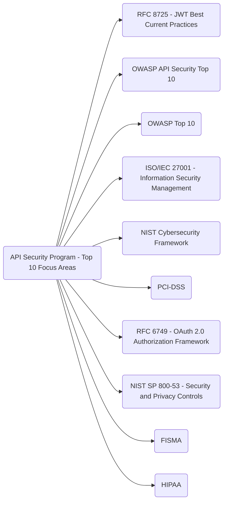

# Standards for API Security

This is an aggregation of public standards that are applicable to API security for an organization. This is broken up into two parts:

- [Regulations](#regulations) - governance prescribed by regulatory bodies who publish guidelines that must be followed for compliance.
- [Best Practices](#best-practices) - guidance that is published by various organizations to help produce the most secure implementation.

Also on this page:

- [Visualization](#visualization) - a visualization of how these standards correlate to functional areas of an organization.
- [Initial Top 10 Focus Areas](#initial-top-10-focus-areas) - when starting out with an API Security Program, these are 10 areas when an organization could focus.

## Regulations

Below are the regulations that might apply to most large enterprises.

### CCPA (California Consumer Privacy Act):

> https://www.oag.ca.gov/privacy/ccpa

#### Requirements

- **Notice Upon Collection** — Businesses MUST provide notice at or before the point of personal information collection.
- **Data Disclosure Requirements** — Businesses SHALL disclose the categories of personal information they collect and the purposes for which the information is used.
- **Right to Deletion** — Consumers ALWAYS have the right to request deletion of their personal information.
- **Response Timeframe** — Businesses MUST respond to consumer requests for data access or deletion within 45 days.
- **Security Measures** — Businesses SHALL implement reasonable security procedures and practices appropriate to the nature of the information.
- **Opt-out Rights** — Consumers ALWAYS have the right to opt-out of the sale of their personal information.
- **Opt-out Link** — Businesses MUST provide a clear and accessible "Do Not Sell My Personal Information" link on their website's home page.
- **Non-Discrimination** — Businesses SHALL NOT discriminate against consumers who exercise their CCPA rights.
- **Consent for Minors** — For minors under the age of 16, businesses MUST obtain opt-in consent before selling their personal information.
- **Parental Consent for Children** — For children under the age of 13, businesses MUST obtain opt-in consent from the child's parent or guardian.
- **Employee Training** — Businesses MUST conduct training sessions for employees who handle personal information or consumer inquiries.
- **Audit Compliance** — Businesses ALWAYS perform regular audits to ensure compliance with CCPA.

### CPRA (California Privacy Rights Act)

> https://en.wikipedia.org/wiki/California_Privacy_Rights_Act

#### Requirements

- **Expanded Disclosure** — Businesses MUST clearly disclose what personal information is being collected, how it's being used, and to whom it is disclosed.
- **Sensitive Personal Information** — Businesses SHALL provide consumers with the option to limit the use of sensitive personal information.
- **Correction Rights** — Consumers ALWAYS have the right to request the correction of their personal information held by businesses.
- **Risk Assessment** — Businesses MUST regularly conduct risk assessments on their processing practices to evaluate risks to consumer privacy.
- **Data Minimization** — Businesses SHALL implement practices that limit data collection, retention, and usage to what is reasonably necessary.
- **Consumer Rights Enforcement** — Consumers ALWAYS have the right to opt-out of automated decision-making technology.
- **Transparency in Automated Decision-Making** — Businesses MUST provide meaningful information about the logic involved in such decision-making processes.
- **Data Protection Obligations** — Businesses SHALL implement reasonable security measures to protect consumers' personal information.
- **Right to Opt-Out** — Consumers ALWAYS have the right to opt-out of the sale or sharing of their personal information.
- **Service Provider Contracts** — Businesses MUST ensure that service provider contracts require compliance with the CPRA.
- **Right to Delete** — Consumers ALWAYS have the right to request the deletion of personal information, with enhanced rights under CPRA.
- **Children's Privacy** — Businesses MUST obtain consent from parents for children under 13 and direct consent from minors between 13 and 16 for data sales.
- **Audit Trails** — Businesses ALWAYS perform audits to ensure accurate processing and use of personal information as stipulated by CPRA.

### GDPR (General Data Protection Regulation)

> https://gdpr.eu/

#### Requirements

- **Consent Management** — Businesses MUST obtain clear and explicit consent from individuals before processing personal data.
- **Data Protection by Design and by Default** — Businesses SHALL implement data protection principles in the design of new products and systems.
- **Right to Access** — Individuals ALWAYS have the right to access their personal data and obtain information about how this data is processed.
- **Right to Rectification** — Individuals ALWAYS have the right to request the correction of inaccurate personal data.
- **Right to Erasure ('Right to be Forgotten')** — Individuals ALWAYS have the right to request the deletion of personal data when it is no longer necessary.
- **Data Portability** — Individuals MUST be able to receive their personal data in a structured, commonly used format, and transfer it to another data controller.
- **Data Breach Notification** — Businesses MUST notify the relevant supervisory authority of data breaches likely to result in a risk to the rights and freedoms of individuals, typically within 72 hours.
- **Data Protection Officer (DPO)** — Businesses MUST appoint a Data Protection Officer if they process sensitive data on a large scale or collect information on many consumers.
- **Privacy Impact Assessment** — Businesses SHALL conduct Privacy Impact Assessments to identify and mitigate risks associated with data processing activities.
- **Transparency** — Businesses MUST provide detailed, clear, and easily accessible statements about how personal data is used and processed.
- **Cross-border Data Transfer** — Businesses MUST ensure that appropriate safeguards are in place when transferring personal data outside the EU.
- **Accountability** — Businesses are REQUIRED to demonstrate compliance with GDPR, including maintaining comprehensive records of data processing activities.
- **Children's Data** — Businesses MUST implement specific measures to protect the personal data of children, particularly in the context of commercial internet services.

### FISMA (Federal Information Security Modernization Act)

> https://www.cisa.gov/topics/cyber-threats-and-advisories/
federal-information-security-modernization-act
#### Requirements

- **System Inventory** — Federal agencies MUST maintain an inventory of all information systems utilized within the agency.
- **Categorization of Information** — Agencies MUST categorize all information and information systems according to the level of security risk.
- **Security Controls Implementation** — Agencies SHALL implement appropriate security controls to protect the integrity, confidentiality, and availability of information systems and data.
- **Risk Assessment** — Agencies MUST conduct regular risk assessments to determine the impact of potential security threats on their operations and assets.
- **Security Authorization** — Information systems MUST be authorized for operation by a senior agency official based on the implementation of necessary security controls.
- **Continuous Monitoring** — Agencies SHALL implement a continuous monitoring strategy to ensure ongoing awareness of information security risks.
- **Incident Response** — Agencies MUST develop and maintain an incident response capability to detect, respond to, and recover from information security incidents.
- **Annual Review** — Agencies are REQUIRED to conduct annual reviews of their information security programs and report the results to the Office of Management and Budget (OMB).
- **Training and Awareness** — Agencies MUST provide information security training to all personnel, including contractors and other users of information systems that support the operations and assets of the agency.
- **Cooperation with Inspectors General** — Agencies MUST cooperate with Inspectors General in the conduct of audits, evaluations, and investigations.
- **Information System Security Policies** — Agencies SHALL develop, document, and implement information system security policies that are consistent with standards and guidelines provided by NIST.

### HIPAA (Health Insurance Portability and Accountability Act)

> https://www.hhs.gov/hipaa/index.html

#### Requirements

- **Privacy Rule Compliance** — Covered entities MUST ensure the privacy of protected health information (PHI) and provide patients with appropriate access to their medical records.
- **Security Rule Compliance** — Entities SHALL implement physical, administrative, and technical safeguards to ensure the confidentiality, integrity, and security of electronic protected health information (ePHI).
- **Breach Notification Rule** — Entities MUST notify affected individuals, the Secretary of HHS, and, in certain circumstances, the media of breaches of unsecured PHI in a timely manner, generally no later than 60 days after discovery.
- **Minimum Necessary Use** — When using or disclosing PHI or when requesting PHI from another covered entity, entities MUST make reasonable efforts to limit information to the minimum necessary to accomplish the intended purpose.
- **Business Associate Agreements** — Covered entities MUST ensure that business associates who handle PHI agree to the same stringent conditions for the use and disclosure of PHI through formal agreements.
- **Risk Analysis and Management** — Entities MUST conduct an accurate and thorough assessment of the potential risks and vulnerabilities to the confidentiality, integrity, and availability of ePHI.
- **Training and Awareness** — Entities MUST provide training programs to all employees concerning the entity’s privacy policies and procedures.
- **Patient Rights** — Entities SHALL ensure that patients can exercise their rights, including the right to request privacy protections, access PHI, amend their PHI, and receive an accounting of disclosures.
- **Complaints Management** — Entities MUST provide a process for individuals to make complaints concerning the covered entity’s privacy policies and procedures.
- **Data Encryption** — Entities SHOULD implement encryption for ePHI whenever deemed appropriate based on the risk assessment.
- **Audit Controls** — Entities SHALL implement hardware, software, and procedural mechanisms to record and examine activity in information systems that contain or use ePHI.

### ISO 22301 Security and Resilience / Business Continuity

> https://www.iso.org/standard/75106.html

#### Requirements

- **Business Continuity Policy** — Organizations MUST establish a business continuity policy that is appropriate to the purpose of the organization.
- **Business Impact Analysis** — Organizations SHALL conduct a business impact analysis (BIA) to identify critical business functions and the resources required to support them.
- **Risk Assessment** — Organizations MUST conduct risk assessments to determine threats and vulnerabilities to business operations and the business environment.
- **Strategy Development** — Based on the BIA and risk assessment, organizations SHALL develop business continuity strategies that address the risks and ensure continuity of operations.
- **Incident Response Structure** — Organizations MUST establish an incident response structure to manage disruptive incidents when they occur.
- **Business Continuity Plans** — Organizations SHALL develop, implement, and maintain business continuity plans that detail the process to recover critical business functions.
- **Training and Awareness** — Organizations MUST ensure that all relevant personnel are trained and aware of their roles and responsibilities within the business continuity plans.
- **Exercises and Testing** — Organizations SHALL regularly test and exercise the business continuity plans to ensure their effectiveness and to identify areas for improvement.
- **Performance Evaluation** — Organizations MUST monitor and evaluate the performance and effectiveness of the business continuity management system through regular reviews and audits.
- **Management Review** — Senior management SHALL review the business continuity management system regularly to ensure its continuing suitability, adequacy, and effectiveness.
- **Continual Improvement** — Organizations MUST continually improve the effectiveness of the business continuity management system through the use of the business continuity policy, objectives, audit results, analysis of monitored events, corrective actions, and management review.

### ISO/IEC 27001 Information Security, Cybersecurity and Privacy Protection

> https://www.iso.org/standard/27001

#### Requirements

- **ISMS Establishment** — Organizations MUST establish, implement, maintain, and continually improve an information security management system.
- **Leadership Commitment** — Top management SHALL demonstrate leadership and commitment to the ISMS by ensuring the integration of the information security management system requirements into the organization’s processes.
- **Policy Development** — Organizations MUST define an information security policy that is appropriate to the purpose of the organization, provides a framework for setting objectives, and includes commitments to satisfy applicable requirements and continually improve the ISMS.
- **Risk Management** — Organizations MUST assess and treat information security risks, tailored to the needs of the organization.
- **Security Objectives** — Organizations SHALL establish information security objectives at relevant functions and levels. These objectives must be measurable and consistent with the information security policy.
- **Resource Management** — Organizations MUST determine and provide the resources needed to establish, implement, maintain, and continually improve the ISMS.
- **Competence** — Organizations SHALL ensure that all persons doing work under the organization’s control are competent to perform information security tasks.
- **Awareness** — Organizations MUST conduct awareness programs to make persons aware of the information security policy and their contribution to the effectiveness of the ISMS.
- **Communication** — Organizations SHALL determine the need for internal and external communications relevant to the information security management system including: what to communicate, when to communicate, with whom to communicate, and how to communicate.
- **Documentation** — Organizations MUST maintain documented information to support the operation of processes and retain documented information to have confidence that the processes are being carried out as planned.
- **Operational Planning and Control** — Organizations SHALL plan, implement, and control the processes needed to meet information security requirements, and implement the actions determined in risk assessment and risk treatment.
- **Performance Evaluation** — Organizations MUST monitor, measure, analyze, and evaluate information security performance and effectiveness.
- **Internal Audit** — Organizations SHALL conduct internal audits at planned intervals to provide information on whether the information security management system conforms to the organization’s requirements for information security management and the requirements of this standard.
- **Management Review** — Top management SHALL review the organization’s information security management system at planned intervals to ensure its continuing suitability, adequacy, and effectiveness.
- **Improvement** — Organizations MUST continually improve the suitability, adequacy, and effectiveness of the ISMS.

### ISO/IEC 27017 Security Techniques for Cloud Services

> https://www.iso.org/standard/43757.html

#### Requirements

- **Cloud Service Customer Policies** — Organizations SHOULD define and maintain policies for the security of cloud services.
- **Segregation in Virtual Computing Environments** — Cloud service providers MUST implement segregation controls in virtual computing environments to ensure data protection and confidentiality.
- **Alignment with Cloud Security** — Organizations MUST align their cloud security management with the overall organizational security policy, ensuring that cloud services meet or exceed internal security requirements.
- **User Identity and Authentication Management** — Cloud service providers MUST establish strong identity and authentication management systems to control access to cloud resources.
- **Asset Management** — Organizations SHOULD maintain an inventory of cloud assets and define responsibilities for managing these assets.
- **Access Control** — Organizations MUST implement robust access control mechanisms to limit access to cloud services based on the principle of least privilege.
- **Cryptographic Controls** — Use of cryptographic controls SHOULD be applied to protect data in transit and at rest, with a focus on strong key management practices.
- **Incident Response** — Cloud service providers MUST develop and implement an incident response plan that aligns with their cloud infrastructure and customer requirements.
- **Compliance** — Organizations MUST regularly review compliance with legal, regulatory, and contractual requirements within the cloud environment.
- **Data Backup and Recovery** — Organizations MUST implement data backup and recovery procedures to ensure data integrity and availability.
- **Network Security** — Cloud service providers MUST secure their networks, implementing controls to protect data in transit and monitor network traffic for malicious activities.
- **Acquisition, Development, and Maintenance of Systems** — Cloud service providers SHOULD ensure that security is integrated into the system development lifecycle for cloud services.
- **Security Assessments** — Regular security assessments MUST be conducted to evaluate the effectiveness of implemented security controls in the cloud environment.
- **Shared Security Responsibilities** — Organizations SHOULD clearly define and communicate the security responsibilities that are shared between the cloud service provider and the customer.
- **Monitoring and Logging** — Organizations MUST implement monitoring and logging mechanisms to detect and respond to security incidents within cloud services.

### ISO/IEC 27018 Security Techniques for PII in Public Cloud

> https://www.iso.org/standard/76559.html

#### Requirements

- **Consent for PII Processing** — Cloud service providers MUST obtain explicit consent from data subjects before processing personally identifiable information (PII) in public clouds.
- **PII Protection** — Organizations MUST implement technical and organizational measures to protect PII against unauthorized or unlawful processing and against accidental loss, destruction, or damage.
- **Data Minimization** — Cloud service providers SHOULD collect and process only the minimum necessary PII required for the completion of its duties.
- **Transparency** — Organizations MUST be transparent about the processing of PII, including providing clear information about the types of data processed, the purposes of processing, and the rights of data subjects.
- **Restrictions on PII Use** — Use of PII SHOULD be strictly for the purposes specified at the time of collection, and organizations must ensure compliance with these specified purposes.
- **PII Disclosure** — Cloud service providers MUST not disclose PII to third parties without the explicit consent of the data subject, unless required by law.
- **Data Subject Rights** — Organizations MUST ensure that data subjects can exercise their rights regarding their PII, such as access, correction, and deletion.
- **PII Breach Notification** — In the event of a PII breach, cloud service providers MUST notify relevant stakeholders, including data subjects and regulatory bodies, in a timely manner.
- **Data Retention and Deletion** — Organizations MUST define and implement policies for the retention and deletion of PII, ensuring that data is not kept longer than necessary.
- **Accountability** — Cloud service providers SHOULD implement governance measures that demonstrate compliance with privacy policies and legal requirements.
- **Contractual Obligations** — Organizations MUST ensure that contracts with cloud service providers reflect the security and privacy requirements for the protection of PII.
- **Employee Confidentiality** — Organizations MUST ensure that personnel handling PII are subject to confidentiality obligations.
- **Audit and Compliance** — Organizations SHOULD conduct regular audits to ensure compliance with privacy policies and regulatory requirements for PII protection.
- **Data Encryption** — PII transmitted over public networks MUST be encrypted, and encryption should also be considered for PII stored within cloud services.
- **International Data Transfers** — Organizations MUST ensure that international transfers of PII comply with applicable legal and regulatory requirements, providing appropriate safeguards.

### ISO/IEC 27032 Guidelines for Internet Security

> https://www.iso.org/standard/76070.html

#### Requirements

- **Comprehensive Security Framework** — Organizations MUST establish a comprehensive security framework that addresses internet security as an integral part of their overall information security management.
- **Collaboration Mechanisms** — Organizations SHOULD implement collaboration mechanisms to enable effective communication and cooperation among various stakeholders in the internet ecosystem.
- **Risk Assessment** — Organizations MUST conduct regular risk assessments to identify, analyze, and evaluate internet security risks.
- **Security Measures** — Organizations MUST implement appropriate security measures to protect against identified risks, ensuring the confidentiality, integrity, and availability of information.
- **Incident Management** — Organizations MUST develop and maintain an incident management process to detect, report, and respond to internet security incidents effectively.
- **User Awareness and Training** — Organizations MUST provide ongoing awareness and training programs to educate users about internet security risks and safe online behaviors.
- **Cybersecurity Policies** — Organizations MUST develop and enforce cybersecurity policies that comply with legal and regulatory requirements and align with best practices.
- **Critical Information Infrastructure Protection** — Organizations SHOULD take specific measures to protect critical information infrastructure from internet-based threats.
- **Information Sharing** — Organizations SHOULD engage in information sharing platforms to exchange knowledge about threats, vulnerabilities, and incidents with other entities.
- **Monitoring and Analysis** — Organizations MUST implement monitoring systems to detect unusual activities and potential threats on the internet.
- **Relationship Management** — Organizations SHOULD manage relationships with internet service providers and other third parties to enhance security across networks and services.
- **Authentication and Access Control** — Organizations MUST use robust authentication methods and enforce strict access control measures to restrict unauthorized access to systems and data.
- **Encryption and Data Protection** — Organizations SHOULD employ encryption technologies to secure sensitive data transmitted over the internet.
- **Emergency and Continuity Planning** — Organizations MUST develop and test emergency response and business continuity plans that address potential internet security incidents.
- **Cyber Resilience** — Organizations SHOULD build cyber resilience capabilities to withstand and recover from internet security breaches effectively.

### ISO/IEC 27035 Information Security Incident Management

> https://www.iso.org/standard/78974.html

#### Requirements

- **Incident Management Policy** — Organizations MUST establish and maintain an information security incident management policy that provides the framework for implementing and managing an effective incident response architecture.
- **Planning and Preparation** — Organizations SHALL plan and prepare for incident response, including the establishment of an Incident Response Team (IRT) and the development of incident response procedures.
- **Reporting Security Events** — Organizations MUST establish mechanisms for personnel to report security events promptly to the Incident Response Team.
- **Assessment of Events** — Organizations SHALL assess reported security events to determine if they qualify as security incidents.
- **Response to Incidents** — Organizations MUST respond to confirmed security incidents according to predefined procedures and plans.
- **Learning from Incidents** — Organizations SHALL conduct post-incident reviews to learn from incidents and find opportunities for improvement.
- **Quantitative and Qualitative Incident Assessment** — Organizations SHALL assess incidents quantitatively and qualitatively to understand the impact and apply appropriate resources.
- **Incident Classification** — Organizations MUST classify incidents according to predefined categories to prioritize response and resource allocation.
- **Incident Response Testing** — Organizations SHALL test incident response capabilities periodically to ensure preparedness and effectiveness.
- **Communication** — During and after incidents, organizations MUST manage communication with internal and external stakeholders, including regulatory authorities if required.
- **Documentation** — Organizations MUST document all detected incidents, their handling process, and outcomes to support continuous improvement and compliance requirements.
- **Continual Improvement** — Organizations SHALL continually improve incident response and management processes based on the learnings and outcomes of previous incidents.

### ISO/IEC 27701 Security Techniques for Privacy Information Management

> https://www.iso.org/standard/71670.html

#### Requirements

- **Privacy Information Management System (PIMS)** — Organizations MUST establish, implement, maintain, and continuously improve a Privacy Information Management System (PIMS) integrated with or as an extension of their ISMS.
- **Data Processing Roles** — Organizations MUST clearly define and document roles and responsibilities related to data processing activities to ensure compliance with privacy regulations.
- **Privacy Risk Assessment** — Organizations MUST conduct regular privacy risk assessments to identify, analyze, and evaluate risks associated with the processing of personal information.
- **Privacy Controls** — Organizations MUST implement appropriate privacy controls to mitigate identified risks and protect personal information in accordance with applicable privacy laws and regulations.
- **Third-Party Management** — Organizations MUST ensure that third-party service providers who handle personal information comply with relevant privacy requirements and contractual obligations.
- **Data Subject Rights** — Organizations MUST establish processes to respect and facilitate the exercise of data subject rights, such as access, rectification, erasure, and data portability.
- **Privacy Impact Assessments** — Organizations SHOULD conduct Privacy Impact Assessments (PIAs) for new and significantly altered systems that handle personal information.
- **Consent Management** — Organizations MUST implement mechanisms to obtain, manage, and document consent from individuals for the processing of their personal information where required by law.
- **Documentation and Record-Keeping** — Organizations MUST maintain comprehensive documentation and records of their PIMS and privacy practices to demonstrate compliance with applicable privacy laws.
- **Training and Awareness** — Organizations MUST provide regular privacy training and awareness programs to ensure that employees understand their privacy obligations.
- **Breach Notification** — Organizations MUST establish and follow procedures for managing data breaches, including mechanisms for assessing the severity of breaches and notifying affected data subjects and regulatory authorities in accordance with legal requirements.
- **Privacy by Design and Default** — Organizations MUST apply the principles of privacy by design and default at all stages of product or service development to ensure privacy is embedded within their processes.
- **International Data Transfers** — Organizations MUST implement measures to ensure that international transfers of personal information are conducted in compliance with applicable legal frameworks and standards.
- **Continuous Improvement** — Organizations MUST regularly review and update their PIMS to adapt to changes in legal requirements, business practices, and technological developments.
- **Privacy Culture** — Organizations SHOULD foster a culture of privacy and security within the organization to enhance compliance and alignment with privacy policies and practices.

### ISO/IEC 29100 Information Technology Privacy Framework

> https://www.iso.org/standard/85938.html

#### Requirements

- **Privacy Principles Adoption** — Organizations MUST adopt and adhere to the privacy principles outlined in ISO/IEC 29100 to ensure the protection of personal data.
- **Data Minimization** — Organizations SHALL ensure that only the minimum necessary personal data is collected, used, and retained.
- **Consent Management** — Organizations MUST obtain clear and explicit consent from individuals for the collection, use, and disclosure of their personal data, except where other lawful bases exist.
- **Transparency** — Organizations MUST provide clear, concise, and accessible information about their data processing activities and privacy practices.
- **Accountability** — Organizations SHALL implement governance measures that demonstrate compliance with privacy policies and procedures.
- **Privacy by Design and by Default** — Organizations MUST integrate privacy into the design and operation of IT systems, networked infrastructure, and business practices.
- **Access and Correction Rights** — Individuals ALWAYS have the right to access their personal data and request corrections or deletions where applicable.
- **Privacy Impact Assessments** — Organizations SHALL conduct Privacy Impact Assessments (PIAs) when implementing new technologies or data processing activities that might impact individual privacy.
- **Third-Party Data Sharing** — Organizations MUST ensure that third parties processing personal data on their behalf adhere to the same privacy requirements as the primary organization.
- **Breach Notification** — Organizations MUST notify relevant stakeholders, including affected individuals and regulators, of breaches involving personal data in a timely manner.
- **Data Quality** — Organizations SHALL maintain accurate, complete, and relevant personal data for the purposes for which it is processed.
- **Security of Processing** — Organizations MUST implement appropriate technical and organizational measures to ensure the security of personal data.
- **Privacy Training** — Organizations MUST provide training on privacy policies and procedures to employees who have access to personal data.

### NIST CSF (Cyber Security Framework)

> https://www.nist.gov/cyberframework

#### Requirements

- **Identify Function** — Organizations MUST develop an organizational understanding to manage cybersecurity risk to systems, assets, data, and capabilities.
  - **Asset Management** — Organizations SHALL catalog and manage data, personnel, devices, systems, and facilities.
  - **Business Environment** — Organizations MUST understand the business context, the resources that support critical functions, and the related cybersecurity risks.
  - **Governance** — Organizations SHALL establish and maintain governance to provide a structure for setting objectives and policies.
  - **Risk Assessment** — Organizations MUST identify and prioritize risks to organizational operations and assets, individuals, other organizations, and the Nation.
  - **Risk Management Strategy** — Organizations SHALL implement risk management processes and ensure that cybersecurity risks are addressed.
- **Protect Function** — Organizations SHALL develop and implement appropriate safeguards to ensure delivery of critical services.
  - **Identity Management and Access Control** — Organizations MUST limit access to assets and associated facilities to authorized users, processes, or devices.
  - **Awareness and Training** — Organizations SHALL provide training to personnel to perform their cybersecurity roles effectively.
  - **Data Security** — Organizations MUST implement policies and procedures to protect data in transit and at rest.
  - **Information Protection Processes and Procedures** — Organizations MUST maintain security policies that protect information and manage protective technologies.
  - **Maintenance** — Organizations SHALL perform maintenance and repairs of industrial controls and information system components in a timely manner.
  - **Protective Technology** — Organizations MUST ensure the security and resilience of systems and assets.
- **Detect Function** — Organizations SHALL develop and implement appropriate activities to identify the occurrence of a cybersecurity event.
  - **Anomalies and Events** — Organizations MUST detect anomalous activity and potential cybersecurity events.
  - **Security Continuous Monitoring** — Organizations SHALL continuously monitor the security of information systems and environments of operation.
  - **Detection Processes** — Organizations MUST maintain detection processes and procedures to ensure timely and adequate awareness of anomalous events.
- **Respond Function** — Organizations SHALL develop and implement appropriate activities to take action regarding a detected cybersecurity event.
  - **Response Planning** — Organizations MUST execute a response plan during or after a cybersecurity event.
  - **Communications** — Organizations SHALL manage communications during and after a cybersecurity incident, including with stakeholders and authorities.
  - **Analysis** — Organizations MUST analyze the impact and conduct investigations to determine response actions.
  - **Mitigation** — Organizations SHALL perform activities to prevent expansion of an event and resolve the incident.
  - **Improvements** — Organizations MUST improve response plans based on lessons learned from current and previous detection/response activities.
- **Recover Function** — Organizations SHALL develop and implement appropriate activities to maintain plans for resilience and to restore any capabilities or services impaired due to a cybersecurity event.
  - **Recovery Planning** — Organizations MUST execute recovery processes and procedures to ensure timely restoration of systems or assets affected by cybersecurity incidents.
  - **Improvements** — Organizations SHALL incorporate lessons learned into the recovery strategies.
  - **Communications** — Organizations SHALL manage internal and external communications during and after the recovery from a cybersecurity incident.

### NIST Digital Identity Guidelines (SP 800-63*)

> https://pages.nist.gov/800-63-3/

#### Requirements

- **Identity Proofing** — Organizations MUST conduct identity proofing to establish the uniqueness and validity of an individual’s identity.
  - **Identity Assurance Level (IAL)** — Organizations SHALL determine the appropriate IAL based on the sensitivity of the application and the risk of misidentification.
  - **Identity Verification** — Organizations MUST verify identity information using reliable and trustworthy sources.
- **Authentication** — Organizations SHALL implement strong authentication mechanisms according to the defined assurance levels.
  - **Authentication Assurance Level (AAL)** — Organizations MUST determine the appropriate AAL based on the potential impacts of unauthorized access.
  - **Multi-factor Authentication** — Organizations SHALL use multi-factor authentication for systems processing sensitive or high-risk data.
  - **Authentication Protocols** — Organizations MUST use authentication protocols that protect the confidentiality of authentication secrets.
- **Credential Management** — Organizations SHALL manage credentials throughout the lifecycle of the identity.
  - **Credential Issuance** — Organizations MUST issue credentials only after successful identity proofing.
  - **Credential Revocation** — Organizations SHALL provide a means to revoke credentials when they are no longer valid or compromised.
  - **Credential Recovery** — Organizations MUST establish and follow a secure process for credential recovery to prevent unauthorized access.
- **Federated Identity** — Organizations MAY use federated identity systems to enable the portability of identity information across different systems.
  - **Federation Assurance Level (FAL)** — Organizations SHALL assess and implement the appropriate FAL when participating in a federated identity system.
- **Privacy Considerations** — Organizations MUST implement privacy-enhancing technologies to protect personal information.
  - **Privacy Requirements** — Organizations SHALL adhere to applicable privacy laws and guidelines to ensure the protection of personally identifiable information.
  - **Minimization of Personally Identifiable Information** — Organizations MUST minimize the use of personally identifiable information to what is strictly necessary for the intended purpose.
- **Security Requirements** — Organizations MUST implement security measures to protect identity data.
  - **System Security Plan** — Organizations SHALL develop and maintain a system security plan that includes identity management.
  - **Data Encryption** — Organizations MUST encrypt sensitive identity data both at rest and in transit.
  - **User Education** — Organizations SHALL educate users about secure practices related to their digital identity.

### NIST SP 800-34 (Contingency Planning Guide for Federal Information Systems)

> https://csrc.nist.gov/pubs/sp/800/34/r1/upd1/final

#### Requirements

- **Contingency Policy** — Organizations MUST develop a formal, documented contingency policy that addresses purpose, scope, roles, responsibilities, management commitment, and coordination among organizational entities.
- **Contingency Planning** — Organizations SHALL develop a comprehensive contingency plan for each major federal information system.
  - **Plan Elements** — The contingency plan MUST include:
    - Contact information for key personnel
    - Identification of critical resources
    - Detailed recovery procedures
    - Plan for maintaining essential functions
  - **Plan Review and Update** — Organizations MUST review and update the contingency plan annually or whenever significant system changes occur.
- **Training and Testing** — Organizations SHALL train personnel in their roles and responsibilities concerning the contingency plan and conduct tests and exercises to validate the effectiveness of the plan.
  - **Training Program** — Organizations MUST implement a training program to ensure that all employees understand contingency planning principles and their specific roles during a contingency.
  - **Testing and Exercises** — Organizations SHALL conduct tests and exercises to verify the effectiveness of contingency plans and related measures.
- **Data Backup** — Organizations MUST regularly backup system data to ensure that it can be recovered effectively in the event of a disruption.
  - **Data Backup Plan** — The contingency plan MUST include a data backup plan that identifies:
    - What data to backup
    - Backup frequency
    - Storage location
- **Disaster Recovery** — Organizations SHALL establish a disaster recovery capability to restore system functionality following a disaster.
  - **Disaster Recovery Plan** — The contingency plan MUST include a disaster recovery plan that outlines procedures for restoring systems and recovering data after a disaster.
- **Cyber Incident Response** — Organizations MUST include a cyber incident response plan that outlines procedures to address cyber attacks that may lead to data loss or system outages.
  - **Incident Response Team** — Organizations SHALL establish an incident response team responsible for implementing the cyber incident response plan.
- **Alternative Processing Sites** — Organizations MUST identify alternative processing sites where systems can continue critical functions in the event of a primary site becoming unavailable.
  - **Alternative Site Details** — The contingency plan SHOULD include information on the capabilities of alternative sites and the process for switching to these sites.
- **Reconstitution Procedures** — Organizations SHALL develop procedures to restore systems to normal operations after the threat has passed.
  - **Reconstitution Plan** — The contingency plan MUST include reconstitution procedures to return IT systems to normal operations.

### NIST SP 800-40 (Enterprise Patch Management)

> https://csrc.nist.gov/pubs/sp/800/40/r4/final

#### Requirements

- **Patch Management Policy** — Organizations MUST develop a formal, documented patch management policy that addresses the scope, roles, responsibilities, and management commitment to patching operations.
- **Patch Management Process** — Organizations SHALL establish and implement a structured patch management process that includes:
  - **Identification of Vulnerabilities** — Organizations MUST regularly identify vulnerabilities in systems that require patching.
  - **Assessment of Patches** — Before deployment, organizations SHALL assess patches to determine their applicability and potential impact on system stability and security.
  - **Acquisition of Patches** — Organizations MUST acquire patches from reputable sources to ensure their integrity and authenticity.
  - **Test and Evaluate Patches** — Organizations SHALL test patches in a non-production environment to verify their functionality and lack of adverse side effects.
  - **Deployment of Patches** — Organizations MUST deploy patches to production environments in a timely manner, following successful testing and evaluation.
  - **Verification and Reporting** — After deployment, organizations SHALL verify that patches have been applied correctly and generate reports for compliance and auditing purposes.
- **Training and Awareness** — Organizations MUST train IT staff and users about the importance of patch management and the specific procedures involved in the patch management process.
- **Patch Prioritization** — Organizations SHALL prioritize patches based on the severity of the vulnerabilities they address and the criticality of the affected systems.
- **Configuration Management Integration** — Organizations MUST integrate patch management processes with configuration management to ensure consistency and prevent configuration drift.
- **Automated Patch Management Tools** — Organizations SHOULD implement automated tools to streamline the patch management process, including detection, deployment, and verification.
- **Continuous Improvement** — Organizations MUST regularly review and refine their patch management processes to adapt to new vulnerabilities and changes in the technology landscape.

### NIST SP 800-41 (Guidelines of Firewalls and Firewall Policy)

> https://csrc.nist.gov/pubs/sp/800/41/r1/final

#### Requirements

- **Firewall Policy Development** — Organizations MUST develop a comprehensive firewall policy that outlines the management of firewall configurations, responsibilities, and procedures.
- **Firewall Configuration** — Organizations SHALL configure firewalls to effectively control traffic in accordance with security policies.
  - **Initial Configuration** — Organizations MUST establish a default deny rule that blocks all traffic unless explicitly allowed.
  - **Rule Base Management** — Organizations SHALL regularly review and update firewall rules to ensure they are necessary, correct, and effective.
- **Network Architecture Design** — Organizations MUST design network architectures that include firewall placement to segment networks and protect sensitive resources.
  - **Firewall Placement** — Organizations SHOULD strategically place firewalls at the boundaries of networks to control ingress and egress traffic.
- **Firewall Management** — Organizations MUST implement management practices to maintain firewall operations and security.
  - **Access Control** — Organizations SHALL restrict firewall management access to authorized personnel only.
  - **Authentication and Authorization** — Organizations MUST use strong authentication methods to control access to firewall configurations.
- **Firewall Monitoring and Logging** — Organizations SHALL monitor and log firewall activity to detect and respond to security incidents.
  - **Real-Time Alerts** — Organizations MUST configure firewalls to generate real-time alerts for suspicious activities.
  - **Log Analysis** — Organizations SHALL perform regular analysis of firewall logs to identify potential security threats or policy violations.
- **Firewall Testing and Audits** — Organizations MUST conduct regular testing and audits of firewall configurations and policies to ensure they effectively protect against known and emerging threats.
  - **Vulnerability Scanning** — Organizations SHOULD perform vulnerability scans on firewalls to identify and mitigate potential weaknesses.
- **Firewall Maintenance** — Organizations MUST implement procedures for regular updates and patches to firewall systems to address security vulnerabilities.
- **Firewall Training** — Organizations MUST provide training for personnel responsible for firewall management, including security practices and response procedures.
- **Incident Response** — Organizations SHALL develop and implement an incident response plan that includes procedures for addressing security incidents affecting firewall operations.

### NIST SP 800-53 (Security and Privacy Controls)

> https://csrc.nist.gov/publications/detail/sp/800-53/rev-5/final

#### Requirements

- **Access Control** — Organizations MUST implement controls to limit and manage access to systems, applications, and data based on the principle of least privilege.
  - **Audit and Accountability** — Organizations SHALL create, protect, and retain system logs to enable monitoring, analysis, investigation, and reporting of unlawful or unauthorized system activity.
  - **Awareness and Training** — Organizations MUST provide security awareness training to all personnel, including managers, executives, and contractors.
  - **Configuration Management** — Organizations SHALL establish and enforce security configuration settings for information technology products employed in organizational systems.
  - **Incident Response** — Organizations MUST develop an operational incident handling capability for organizational systems that includes preparation, detection, analysis, containment, recovery, and user response activities.
  - **Identity and Authentication** — Organizations SHALL manage and authenticate identities to ensure that authorized users and processes are properly identified to information systems.
  - **Media Protection** — Organizations MUST protect digital and non-digital media containing federal information, limiting access to authorized users and physically controlling and securely storing media.
  - **Personnel Security** — Organizations SHALL ensure that individuals occupying positions of responsibility within the organization (including third-party contractors) are trustworthy and meet established security criteria for those positions.
  - **Risk Assessment** — Organizations MUST periodically assess the risk to organizational operations, organizational assets, and individuals resulting from the operation of organizational systems and the processing, storage, or transmission of federal information.
  - **Security Assessment and Authorization** — Organizations SHALL assess the security and privacy controls in federal information systems and environments of operation to determine if the controls are effective in their application.
  - **System and Communications Protection** — Organizations MUST implement controls to protect information transmitted or received by organizational systems.
  - **System and Information Integrity** — Organizations MUST identify, report, and correct information and information system flaws in a timely manner; provide protection from malicious code at appropriate locations within organizational information systems; and monitor information security alerts and advisories.
- **Privacy Control Catalog** — Organizations SHALL integrate a catalog of privacy controls to address the full range of privacy risks and incorporate protections for personally identifiable information (PII) throughout the information lifecycle.
- **Program Management** — Organizations MUST establish, implement, and maintain a program to manage security and privacy risks associated with organizational systems and services.

### NIST SP 800-61 (Computer Security Incident Handling Guide)

> https://csrc.nist.gov/publications/detail/sp/800-61/rev-2/final

#### Requirements

- **Incident Response Policy** — Organizations MUST develop and maintain an incident response policy that defines the scope of incident response activities, including the criteria for incident prioritization.
- **Incident Response Plan** — Organizations SHALL create a formal, documented incident response plan that includes guidelines for incident handling, roles, responsibilities, and how to communicate with internal and external stakeholders.
- **Incident Response Team** — Organizations MUST establish an incident response team (IRT) responsible for executing the incident response plan. Team members SHOULD receive regular training on their incident response roles.
- **Preparation** — Organizations MUST prepare for incident handling by setting up appropriate communication tools, securing forensic tools, and establishing secure storage for incident data.
- **Detection and Analysis** — Organizations SHALL implement mechanisms for detecting and analyzing incidents effectively. This includes:
  - Monitoring for signs of incidents,
  - Analyzing indicators of potential incidents to confirm their occurrence,
  - Effectively categorizing and prioritizing the incidents.
- **Containment, Eradication, and Recovery** — Organizations MUST:
  - Contain incidents to prevent further damage,
  - Eradicate the root causes of incidents,
  - Recover systems, networks, and data to fully restore service.
- **Post-Incident Activity** — Organizations SHALL conduct a post-incident review to identify lessons learned and to develop strategies for improving security and response strategies. This includes:
  - Reviewing the effectiveness of the incident response procedures,
  - Modifying the incident response plan based on lessons learned,
  - Updating policies and procedures to prevent similar incidents in the future.
- **Coordination and Information Sharing** — Organizations SHOULD coordinate with external organizations (e.g., other incident response teams, law enforcement) and share information about incidents as appropriate to assist in response and to enhance situational awareness.
- **Continuous Improvement** — Organizations MUST regularly update and test the incident response plan to adapt to new threats, incorporate new security technologies, and improve response capabilities.

### NIST SP 800-92 (Guide to Computer Security Log Management)

> https://csrc.nist.gov/pubs/sp/800/92/final

#### Requirements

- **Log Management Policy** — Organizations MUST develop and implement a log management policy that outlines the scope, roles, responsibilities, and management commitment to effective log management.
- **Log Generation** — Organizations SHALL configure systems to generate logs for security-relevant events. Logs MUST capture sufficient detail to reconstruct the events.
- **Log Collection** — Organizations MUST establish mechanisms to securely collect logs from all systems, ensuring data integrity and confidentiality during transmission.
- **Log Aggregation** — Organizations SHOULD implement log aggregation solutions to centralize the storage and management of log data, facilitating more effective analysis and correlation.
- **Log Storage** — Organizations MUST ensure secure and efficient storage of log data to protect it from unauthorized access or modification. Log data SHOULD be retained according to organizational policy and regulatory requirements.
- **Log Analysis** — Organizations SHALL perform regular analysis of log data to identify indications of unauthorized or malicious activity and to support the investigation of security incidents.
- **Real-time Monitoring** — Organizations SHOULD implement real-time log monitoring capabilities to detect and respond to incidents promptly.
- **Log Archiving** — Organizations MUST archive logs for long-term retention as required by organizational policy or regulatory compliance needs. Archived logs SHOULD be protected and validated regularly for integrity.
- **Incident Response Integration** — Organizations SHALL integrate log management into their incident response framework, utilizing log data to detect, analyze, and respond to incidents.
- **Audit and Accountability** — Organizations MUST regularly audit log management processes and log data to ensure compliance with policies and effectiveness of controls.
- **Training and Awareness** — Organizations MUST provide training to personnel responsible for log management to ensure they understand their roles and responsibilities and how to handle log data appropriately.
- **Continuous Improvement** — Organizations SHOULD continually assess and improve log management practices to address evolving threats and to incorporate advances in technology.

### NIST SP 800-94 (Guide to Intrusion Detection and Preventions Systems (IDPS))

> https://csrc.nist.gov/pubs/sp/800/94/final

#### Requirements

- **IDPS Selection** — Organizations MUST carefully select IDPS technologies that align with their specific security needs and network architecture.
- **IDPS Deployment** — Organizations SHALL deploy IDPS solutions strategically within their network to monitor traffic to and from all critical components.
- **Configuration and Customization** — Organizations MUST configure and customize the IDPS to effectively identify and respond to threats specific to the organization’s environment.
  - **Signature Tuning** — Organizations SHALL regularly tune the signatures and detection algorithms to reduce false positives and false negatives.
  - **Threshold Adjustment** — Organizations MUST adjust thresholds for alert generation to match the operational environment and risk level.
- **Integration with Other Security Tools** — Organizations SHOULD integrate IDPS with other security tools (e.g., security information and event management systems, firewalls, antivirus) for comprehensive protection.
- **Regular Updates** — Organizations MUST keep the IDPS software and signatures up to date to address new vulnerabilities and attack methods.
- **Monitoring and Analysis** — Organizations SHALL continuously monitor IDPS alerts and analyze detections for signs of potential security incidents.
  - **Response to Detections** — Organizations MUST have procedures in place to respond to IDPS alerts, which may include blocking traffic, alerting staff, or conducting further investigation.
- **IDPS Maintenance** — Organizations MUST perform regular maintenance on the IDPS to ensure it continues to operate effectively and securely.
  - **Software Updates** — Organizations SHALL apply software updates and patches to the IDPS in a timely manner.
  - **Hardware Maintenance** — Organizations MUST ensure that the hardware running the IDPS is functioning correctly and replace components as necessary.
- **Training and Awareness** — Organizations MUST provide training for staff responsible for managing and responding to the IDPS to ensure they understand how to use the system effectively.
- **Documentation and Reporting** — Organizations SHALL maintain documentation of IDPS configurations, incidents detected, and responses to those incidents to support continuous improvement and compliance.
  - **Incident Reporting** — Organizations MUST document and report significant security incidents detected by the IDPS as part of their overall security incident reporting procedure.
- **Performance Evaluation** — Organizations SHOULD periodically evaluate the performance of the IDPS to ensure it meets security objectives and modify configurations as the threat landscape evolves.
		NIST SP 800-128: Guide for Security-Focused Configuration Management of Information 
        ### stems

> https://csrc.nist.gov/pubs/sp/800/128/upd1/final

			#### quirements
- **Configuration Management Plan** — Organizations MUST develop a comprehensive configuration management plan that integrates security into all aspects of configuration management processes.
- **Security Configuration Baselines** — Organizations SHALL establish and maintain security configuration baselines for all information systems within the organization.
- **Configuration Change Control** — Organizations MUST implement a formal change control process that includes security impact analysis for all configuration changes.
- **Configuration Monitoring** — Organizations SHALL continuously monitor systems to detect unauthorized changes and ensure compliance with security baselines.
  - **Automated Configuration Tools** — Organizations SHOULD use automated tools to apply, manage, and verify configuration settings consistently across the organization.
- **Security Patches** — Organizations MUST apply security patches in a timely manner to mitigate vulnerabilities.
  - **Regular Patch Updates** — Organizations SHALL maintain an up-to-date patch management process that includes regular assessments of patch relevance, testing, and deployment.
- **Configuration Documentation** — Organizations MUST maintain up-to-date documentation that includes detailed information on the configuration of each system, including hardware, software, network settings, and security controls.
  - **Security Controls Documentation** — Organizations SHALL document how security controls are implemented within the system configuration.
- **Accountability and Traceability** — Organizations MUST ensure that all configuration management activities are traceable and that individuals responsible for these activities are accountable.
  - **Access Controls** — Organizations SHALL restrict access to configuration management tools and resources to authorized personnel only.
- **Configuration Audits** — Organizations MUST perform regular audits to ensure that:
  - Systems comply with established security configuration baselines,
  - Unauthorized changes are detected and remediated,
  - The configuration management process remains effective and secure.
- **Training and Awareness** — Organizations MUST provide training to personnel responsible for configuration management to ensure they understand their roles, the technology, and the security implications of configuration changes.
  - **Continuous Learning** — Organizations SHOULD provide ongoing learning opportunities to keep configuration management personnel up-to-date with the latest threats, security practices, and technologies.

### NIST SP 800-137 (ISCM for Federal Information Systems and Organizations)

> https://csrc.nist.gov/publications/detail/sp/800-137/final

#### Requirements

- **ISCM Strategy** — Organizations MUST develop a comprehensive ISCM strategy that aligns with organizational risk management strategy and policies.
  - **Define Metrics** — Organizations SHALL define metrics to measure the effectiveness of security controls and the overall security posture.
- **ISCM Program** — Organizations MUST implement an ISCM program that enables ongoing awareness of information security, vulnerabilities, and threats to support organizational risk management decisions.
  - **Integration with Organizational Processes** — The ISCM program SHOULD be integrated with existing risk management and incident response processes.
- **Security Status Monitoring** — Organizations MUST continuously monitor the security status of all organizational systems.
  - **Automated Tools** — Organizations SHOULD utilize automated tools to support continuous monitoring and real-time risk management.
  - **Regular Assessments** — Organizations MUST conduct regular assessments of security controls to ensure they are functioning effectively.
- **Risk Scoring** — Organizations SHALL implement risk scoring methodologies to quantify and prioritize risks based on the continuous monitoring data.
- **Response Capabilities** — Organizations MUST develop and implement response capabilities to address findings from continuous monitoring.
  - **Automated Responses** — Where feasible, organizations SHOULD automate responses to common or high-volume security issues detected through ISCM.
- **Reporting** — Organizations MUST regularly report the security status of information systems to appropriate organizational officials to support risk management decisions.
  - **Real-Time Dashboards** — Organizations SHOULD develop real-time dashboards that provide current security statuses and trends over time.
- **ISCM Training** — Organizations MUST provide training for personnel involved in the ISCM process to ensure they understand their roles and the technologies used.
- **Documentation and Policies** — Organizations MUST maintain documentation of the ISCM program, including policies, procedures, and results of continuous monitoring activities.
  - **Documentation Updates** — Organizations SHALL regularly review and update ISCM documentation to reflect changes in technology, threats, and organizational priorities.
- **Review and Update** — Organizations MUST periodically review and update the ISCM strategy and program to adapt to changes in the threat environment, organizational priorities, and technological advancements.

### NIST SP 800-150 (Guide to Cyber Threat Intelligence Sharing)

> https://csrc.nist.gov/pubs/sp/800/150/final

#### Requirements

- **Develop a Sharing Strategy** — Organizations MUST develop a cyber threat intelligence sharing strategy that aligns with their overall cybersecurity strategy.
  - **Define Objectives** — Organizations SHALL define clear objectives for sharing and receiving threat intelligence.
  - **Identify Stakeholders** — Organizations MUST identify internal and external stakeholders and define their roles in the sharing process.
- **Establish Sharing Mechanisms** — Organizations SHALL establish mechanisms for sharing threat intelligence that ensure timeliness, relevance, and security.
  - **Automated Sharing Tools** — Organizations SHOULD utilize automated sharing tools like TAXII (Trusted Automated eXchange of Intelligence Information) to facilitate timely and secure sharing.
- **Select Trusted Partners** — Organizations MUST carefully select trusted partners to engage in threat intelligence sharing.
  - **Assess Trustworthiness** — Organizations SHALL assess the trustworthiness of potential sharing partners to ensure the confidentiality and integrity of shared information.
- **Develop Sharing Agreements** — Organizations MUST develop formal agreements that outline the terms and conditions of the intelligence sharing relationship.
  - **Define Data Handling Protocols** — Organizations SHALL define protocols for handling, storing, and destroying shared intelligence.
  - **Ensure Compliance** — Agreements MUST ensure compliance with applicable laws and regulations regarding privacy and data protection.
- **Integrate Intelligence into Security Operations** — Organizations MUST integrate shared cyber threat intelligence into their security operations to enhance situational awareness and response capabilities.
  - **Operationalize Intelligence** — Organizations SHALL operationalize shared intelligence to improve detection, response, and recovery from cyber incidents.
- **Evaluate Effectiveness** — Organizations SHALL regularly evaluate the effectiveness of their threat intelligence sharing activities.
  - **Feedback Mechanisms** — Organizations SHOULD establish mechanisms to provide and receive feedback on shared intelligence to improve the quality and relevance of the information exchanged.
  - **Continuous Improvement** — Organizations MUST continuously improve their threat intelligence sharing practices based on operational experiences and feedback.
- **Provide Training** — Organizations MUST provide training for all personnel involved in threat intelligence sharing.
  - **Training Programs** — Training SHOULD cover legal and regulatory compliance, operational practices, and security measures related to intelligence sharing.

### PCI-DSS (Payment Card Industry - Data Security Standard)

> https://www.pcisecuritystandards.org/standards/

#### Requirements

- Build and Maintain a Secure Network and Systems
  - **Install and Maintain Firewall Configuration** — Organizations MUST install and maintain a firewall configuration to protect cardholder data.
  - **Do Not Use Vendor-Supplied Defaults** — Organizations SHALL change vendor-supplied defaults for system passwords and other security parameters to protect against unauthorized access.
- Protect Cardholder Data
  - **Protect Stored Cardholder Data** — Organizations MUST protect stored cardholder data using encryption, truncation, masking, and hashing where appropriate.
  - **Encrypt Transmission of Cardholder Data** — Organizations SHALL encrypt transmission of cardholder data across open, public networks to prevent interception by malicious actors.
- Maintain a Vulnerability Management Program
  - **Use and Regularly Update Anti-virus Software** — Organizations MUST use and regularly update anti-virus software or programs to protect against malware.
  - **Develop and Maintain Secure Systems and Applications** — Organizations SHALL develop and maintain secure systems and applications by applying security patches and following secure development practices.
- Implement Strong Access Control Measures
  - **Restrict Access to Cardholder Data** — Access to cardholder data MUST be restricted on a need-to-know basis to minimize risk of unauthorized access.
  - **Identify and Authenticate Access to System Components** — Organizations SHALL assign a unique ID to each person with computer access to ensure that actions on critical data and systems are traceable to known users.
  - **Restrict Physical Access to Cardholder Data** — Organizations MUST physically secure environments where cardholder data is stored, processed, or transmitted to prevent unauthorized access.
- Regularly Monitor and Test Networks
  - **Track and Monitor All Access to Network Resources and Cardholder Data** — Organizations MUST implement tracking and monitoring mechanisms to detect unauthorized access and ensure accountability.
  - **Regularly Test Security Systems and Processes** — Organizations SHALL regularly test security systems and processes to identify vulnerabilities and ensure the effectiveness of protective measures.
- Maintain an Information Security Policy
  - **Maintain a Policy that Addresses Information Security** — Organizations MUST establish, publish, maintain, and disseminate a security policy that addresses how they manage and protect cardholder data.
  - **Risk Assessment** — Organizations SHOULD conduct periodic risk assessments to identify threats and vulnerabilities to cardholder data.
  - **Information Security Awareness** — Organizations MUST conduct awareness training programs for all employees to understand the importance of cardholder data security.

## Best Practices

Below are the best practives that might apply to most organizations.

### MITRE ATT&CK Framework

> https://attack.mitre.org/

#### Requirements

- **Understand Adversary Behaviors** — Organizations SHOULD use the MITRE ATT&CK framework to gain a detailed understanding of how adversaries operate, including their tactics, techniques, and procedures (TTPs).
- **Integrate with Security Operations** — Organizations MAY integrate the MITRE ATT&CK framework into their security operations to enhance threat detection, analysis, and response capabilities.
  - **Tactical Mapping** — Security teams SHOULD map detected behaviors to the ATT&CK framework to identify potential threat actors and their objectives.
- **Use in Red Teaming** — Organizations SHOULD use the MITRE ATT&CK framework to guide red team exercises, simulating known adversary behaviors to test the effectiveness of security controls.
- **Gap Analysis** — Organizations SHOULD conduct gap analyses using the ATT&CK framework to identify and prioritize areas in their defenses that require strengthening.
  - **Assessment of Controls** — Security teams SHOULD assess existing controls against ATT&CK tactics and techniques to determine coverage gaps and overlaps.
- **Enhance Threat Intelligence** — Organizations SHOULD use the ATT&CK framework to enhance their threat intelligence capabilities by correlating external threat information with framework tactics and techniques.
  - **Threat Intelligence Correlation** — Security teams SHOULD correlate threat intelligence with ATT&CK identifiers to better understand and communicate about threats.
- **Training and Development** — Organizations SHOULD provide training on the MITRE ATT&CK framework to improve the cybersecurity knowledge base of their personnel.
  - **Employee Education** — Security personnel SHOULD be educated on the usage of the ATT&CK framework to enhance their ability to identify and respond to threats.
- **Continuous Improvement** — Organizations MAY use insights gained from the application of the MITRE ATT&CK framework to continuously improve their security posture.
  - **Feedback Mechanisms** — Organizations SHOULD establish feedback mechanisms to refine their use of the framework and its integration into security practices.

### OWASP API Security Top 10

> https://owasp.org/www-project-api-security/

#### Requirements

- **Understand API Security Risks** — Organizations SHOULD familiarize themselves with the OWASP API Security Top 10 to understand the most common and critical security risks affecting APIs.
- **Integrate Security into API Lifecycle** — Organizations SHOULD integrate security practices throughout the API development lifecycle, from design to deployment and maintenance.
  - **API Design** — Security teams SHOULD review and advise on secure API design principles to mitigate risks such as broken object level authorization and broken user authentication.
- **Secure Coding Practices** — Developers SHOULD follow secure coding guidelines to protect APIs from common vulnerabilities like injection attacks and improper assets management.
  - **Security Code Reviews** — Code reviews SHOULD specifically focus on security aspects of the APIs, using automated tools and manual inspection techniques.
- **Validation and Sanitization** — Organizations MUST validate and sanitize all inputs to prevent injection and other attacks. It is crucial to handle all data from untrusted sources with caution.
- **Authentication and Authorization Controls** — Organizations SHOULD implement robust authentication and authorization controls to protect against improper access and ensure that users can only perform actions allowed by their permissions.
  - **Secure Authentication Mechanisms** — Developers SHOULD use strong, standards-based authentication mechanisms and avoid custom implementations.
- **API Security Testing** — Organizations SHOULD conduct regular security testing of their APIs to identify and remediate vulnerabilities.
  - **Automated Testing Tools** — Security teams SHOULD use automated testing tools that are capable of scanning APIs for common security issues.
  - **Penetration Testing** — Regular penetration testing by skilled testers SHOULD be conducted to uncover more complex security vulnerabilities.
- **Security Monitoring and Logging** — Organizations SHOULD implement monitoring and logging mechanisms to detect malicious activity and support incident response.
  - **Logging Policies** — Logs SHOULD capture sufficient detail about API transactions to enable forensic analysis while not storing sensitive data.
- **Incident Response Plan** — Organizations SHOULD have an incident response plan that specifically includes APIs to address potential security breaches quickly and effectively.
  - **API-specific Scenarios** — The incident response plan SHOULD include scenarios specific to API security breaches, detailing response steps and communication strategies.
- **Security Training and Awareness** — Organizations SHOULD provide specific training on API security to developers, security teams, and other relevant personnel.
  - **Regular Updates** — Security training programs SHOULD be updated regularly to cover new API security risks and mitigation techniques.

### OWASP Top 10

> https://owasp.org/Top10/

#### Requirements

- **Understand Web Application Security Risks** — Organizations SHOULD familiarize themselves with the OWASP Top 10 to understand the most prevalent and critical security risks affecting web applications.
- **Integrate Security into Development Lifecycle** — Organizations SHOULD integrate security measures into all phases of the web application development lifecycle, from planning through development, deployment, and maintenance.
  - **Secure Design Principles** — Developers SHOULD adhere to secure design principles to prevent security flaws inherent in designs.
- **Secure Coding Practices** — Developers MUST follow secure coding practices to protect web applications from vulnerabilities such as SQL injection, cross-site scripting (XSS), and broken authentication.
  - **Security Code Reviews** — Regular code reviews SHOULD be conducted with a focus on identifying and mitigating security vulnerabilities.
- **Input Validation and Sanitization** — Organizations MUST rigorously validate and sanitize all user inputs to prevent injection attacks and other input-based vulnerabilities.
- **Authentication and Access Control** — Organizations MUST implement robust authentication mechanisms and enforce strict access controls to prevent unauthorized access and ensure data protection.
  - **Strong Authentication** — Implement multi-factor authentication where sensitive data or critical actions are involved.
- **Configuration and Security Misconfiguration Management** — Organizations SHOULD ensure that all system components are configured securely to prevent misconfiguration vulnerabilities.
  - **Secure Default Settings** — Systems SHOULD be deployed with secure default configurations, and unnecessary features MUST be disabled or removed.
- **Security Testing and Assessment** — Organizations SHOULD conduct comprehensive security testing to identify and address vulnerabilities within web applications.
  - **Automated Security Scanning** — Use automated tools to regularly scan web applications for vulnerabilities.
  - **Penetration Testing** — Conduct manual penetration testing periodically to identify vulnerabilities that automated tools might miss.
- **Security Monitoring and Incident Response** — Organizations SHOULD implement continuous monitoring of web applications to detect and respond to security incidents.
  - **Logging and Monitoring** — Implement sufficient logging and monitoring to detect security breaches and support subsequent forensic investigation.
  - **Incident Response Plan** — Develop and maintain an incident response plan tailored to web application security incidents.
- **Security Training and Awareness** — Organizations MUST provide security training to developers, system administrators, and other relevant personnel.
  - **Regular Security Awareness** — Update training materials regularly to include information on emerging security threats and best practices.

### RFC 5424 (The Syslog Protocol)

> https://datatracker.ietf.org/doc/html/rfc5424

#### Requirements

- **Implement Syslog Protocol** — Organizations SHOULD implement the Syslog protocol to standardize the logging of event messages across different systems and applications.
- **Message Formatting** — Organizations MUST format log messages according to the Syslog protocol specification, which includes a header, structured data, and a message part.
  - **Proper Timestamps** — Include precise timestamps in logs to ensure accuracy in event tracking.
- **Log Message Prioritization** — Organizations SHOULD use the Syslog severity levels to prioritize log messages, facilitating quicker response to critical events.
- **Secure Transmission** — Organizations MUST ensure the secure transmission of Syslog messages across networks.
  - **TLS for Syslog** — Implement Transport Layer Security (TLS) for Syslog data to protect against unauthorized access and tampering during transmission.
- **Log Storage and Management** — Organizations SHOULD securely store Syslog messages to prevent unauthorized access and manipulation.
  - **Storage Capacity** — Ensure adequate storage capacity for log retention according to organizational and regulatory requirements.
  - **Log Retention Policy** — Establish and maintain a log retention policy that specifies how long log data should be kept based on legal, regulatory, and business needs.
- **Log Analysis and Monitoring** — Organizations SHOULD implement tools and processes for continuous analysis and monitoring of Syslog messages.
  - **Real-Time Analysis** — Use real-time monitoring tools to analyze Syslog messages and alert on anomalies or potential security incidents.
  - **Log Correlation** — Correlate Syslog messages with other data sources to enhance context and facilitate incident investigation.
- **Compliance with Standards** — Organizations MUST ensure that their implementation of Syslog complies with RFC 5424 and related standards to maintain interoperability and consistency across systems.
- **System Integration** — Organizations SHOULD integrate Syslog with other IT management and security systems to leverage log data for broader operational insights and security monitoring.
  - **Integration with Incident Response** — Use Syslog data as part of the incident response process to help determine the scope and impact of security incidents.
- **Training and Awareness** — Organizations SHOULD provide training to IT staff responsible for managing Syslog to ensure they understand the protocol, its capabilities, and best practices for its use.

### RFC 6811 (BGP Prefix Origin Validation)

> https://datatracker.ietf.org/doc/html/rfc6811

#### Requirements

- **Implement BGP Prefix Origin Validation** — Organizations SHOULD implement BGP Prefix Origin Validation to improve the security of BGP routing operations.
  - **Router Configuration** — Routers MUST be configured to support prefix origin validation using the mechanisms outlined in RFC 6811.
- **Use Resource Public Key Infrastructure (RPKI)** — Organizations MUST utilize RPKI to obtain reliable and validated prefix origin data:
  - **Obtain RPKI Certificates** — Secure RPKI certificates that correspond to the IP address blocks managed by the organization.
  - **Validate Prefix Origins** — Use RPKI to validate that BGP announcements are from authorized origins.
- **Update Routing Policies** — Organizations SHOULD update their routing policies to incorporate validation outcomes:
  - **Invalid Route Rejection** — Configure routers to reject BGP routes with invalid origin validations to prevent routing to maliciously or mistakenly advertised prefixes.
  - **Valid and Unknown Routes** — Determine policies for handling routes with 'valid' and 'unknown' validation states.
- **Monitoring and Logging** — Organizations MUST monitor the results of BGP Prefix Origin Validation and maintain logs for security and troubleshooting purposes:
  - **Monitor Validation Results** — Continuously monitor the outcomes of origin validations to detect anomalies or misconfigurations.
  - **Logging Policies** — Implement comprehensive logging to record validation outcomes and actions taken on BGP routes.
- **Training and Awareness** — Organizations SHOULD provide training to network operators on the importance and mechanisms of BGP Prefix Origin Validation:
  - **Operational Training** — Educate network staff on configuring and managing origin validation to ensure proper implementation and response to validation outcomes.
- **Security Audits** — Organizations SHOULD conduct regular security audits of their BGP routing infrastructure to ensure compliance with RFC 6811 and the effectiveness of implemented controls:
  - **Audit BGP Configurations** — Regularly audit router configurations and routing policies to ensure they align with best practices for prefix origin validation.
  - **Incident Response** — Develop and maintain an incident response plan that includes procedures for addressing issues related to BGP routing and origin validation.
- **Continuous Improvement** — Organizations MUST continually assess and improve their BGP security practices based on operational feedback and emerging threats:
  - **Update Practices** — Regularly review and refine BGP routing and security practices to adapt to changes in the network environment and threat landscape.

### RFC 6749 (OAuth 2.0 Authorization Framework)

> https://datatracker.ietf.org/doc/html/rfc6749

#### Requirements

- **Implement OAuth 2.0 Framework** — Organizations SHOULD implement the OAuth 2.0 framework to manage authorization of third-party applications securely.
- **Client Registration** — Organizations MUST register third-party clients that wish to use OAuth 2.0, requiring them to provide necessary credentials and configuration details.
  - **Unique Client IDs** — Issue unique client IDs to each third-party client to ensure traceability and management.
- **Secure Client Authentication** — Organizations MUST ensure secure authentication of clients when they request access tokens.
  - **Client Secrets** — Issue client secrets if applicable, and ensure they are stored securely by the client.
- **Authorization Grants** — Organizations SHOULD support appropriate OAuth 2.0 authorization grant types depending on the application scenario:
  - **Authorization Code** — For clients that can securely maintain a client secret.
  - **Implicit** — For browser-based or mobile applications that cannot securely maintain a client secret.
  - **Resource Owner Password Credentials** — For clients interacting directly with the resource owner's user-agent.
  - **Client Credentials** — For clients accessing online services or resources they own.
- **Access Tokens** — Organizations MUST issue access tokens to clients after successful authorization, allowing them limited access to the user's resources.
  - **Scope and Expiry** — Define scopes and expiration times for access tokens to limit access and reduce the risk of token theft.
- **Secure Token Transmission** — Organizations SHOULD ensure that tokens are transmitted securely using methods such as HTTPS to protect the data in transit.
- **Token Revocation** — Organizations MUST provide mechanisms for revoking access tokens when necessary to prevent unauthorized access.
- **Refresh Tokens** — Organizations MAY issue refresh tokens to clients, allowing them to obtain new access tokens without further authentication.
  - **Refresh Token Security** — Ensure refresh tokens are stored and used securely to prevent unauthorized use.
- **Authorization Servers** — Organizations MUST securely implement and configure authorization servers that handle OAuth 2.0 requests.
  - **Monitoring and Logging** — Monitor and log all OAuth 2.0 interactions to detect and respond to potential security incidents.
- **Privacy Considerations** — Organizations SHOULD consider the privacy implications of granting access to third-party clients and inform users appropriately.
- **User Consent** — Organizations MUST obtain user consent before issuing tokens, ensuring users are aware of the data and resources that will be accessible.
- **Interoperability and Compliance** — Organizations SHOULD ensure that their OAuth 2.0 implementation is interoperable with other standards-based implementations and complies with relevant specifications and guidelines.

### RFC 8725 (JWT Best Current Practices)

> https://datatracker.ietf.org/doc/html/rfc8725

#### Requirements

- **Understand JWT Security Risks** — Organizations SHOULD familiarize themselves with common security vulnerabilities associated with JWTs as outlined in RFC 8725 to mitigate potential risks.
- **JWT Creation and Validation** — Organizations MUST implement secure methods for creating and validating JWTs:
  - **Secure Key Management** — Use strong, cryptographically secure keys for signing JWTs. Rotate keys periodically and ensure secure storage.
  - **Algorithm Selection** — Organizations MUST use secure and recommended algorithms for JWT signing and encryption. Avoid using algorithms known to be vulnerable such as "none" or weak symmetric keys.
  - **Implicit Trust of JWTs** — Organizations SHOULD NOT implicitly trust JWTs. Validate all JWTs before use, including signature validation and claims verification.
- **JWT Expiry** — Organizations MUST set appropriate expiration times on JWTs to minimize the risk of token reuse:
  - **Short Expiry Times** — Use short expiration times to reduce the window of opportunity for token misuse.
- **JWT Revocation** — Organizations SHOULD implement mechanisms to revoke JWTs when necessary, especially in situations where tokens need to be invalidated prior to their expiration:
  - **Token Blacklisting** — Implement token blacklisting to effectively manage token invalidation.
- **Audience Restriction** — Organizations MUST ensure JWTs contain the "aud" claim to restrict the token's use to intended recipients.
- **Issuer Validation** — Organizations SHOULD validate the "iss" claim in JWTs to ensure tokens are received from legitimate and expected issuers.
- **JWT Scope and Claims Management** — Organizations MUST carefully manage the claims included in JWTs to ensure they contain only necessary information:
  - **Limited Personal Information** — Minimize the amount of personal information and sensitive data in JWTs to reduce privacy risks.
- **Secure Transmission** — Organizations MUST ensure JWTs are transmitted securely to protect them from interception:
  - **Use HTTPS** — Always use HTTPS to transmit JWTs between parties to maintain confidentiality and integrity of the token data.
- **JWT Storage** — Organizations SHOULD securely store JWTs to prevent unauthorized access and misuse:
  - **Secure Storage Locations** — Store JWTs in secure locations, such as HTTPS-only cookies with proper flags (HttpOnly, Secure).
- **Access Control** — Organizations MUST implement proper access control measures to ensure that JWTs are only accessible by authorized parties and services.
- **Interoperability and Compliance** — Organizations SHOULD ensure that their JWT handling practices are compliant with current standards and interoperable with common frameworks and libraries.
- **Continuous Monitoring and Updates** — Organizations SHOULD continuously monitor the use and handling of JWTs and update their practices as necessary to adapt to new threats and vulnerabilities.

### RFC 7525 (Recommendations for TLS and DTLS)

> https://datatracker.ietf.org/doc/html/rfc7525

#### Requirements

- **Adopt Strong Protocols** — Organizations MUST use secure versions of TLS and DTLS to protect communications. Avoid deprecated protocols like SSL and earlier versions of TLS (prior to 1.2).
  - **TLS 1.2 or Higher** — Implement at least TLS version 1.2, with a preference for TLS 1.3 where supported.
- **Use Strong Cipher Suites** — Organizations SHOULD use strong cipher suites that provide adequate security:
  - **Prefer Cipher Suites** — Prefer cipher suites that offer forward secrecy and use strong encryption algorithms such as AES and ChaCha20.
  - **Avoid Weak Cipher Suites** — Avoid cipher suites that use weak encryption algorithms like RC4 or those with known vulnerabilities.
- **Certificate and Key Management** — Organizations MUST manage certificates and cryptographic keys securely:
  - **Use Strong Keys** — Use RSA keys with at least 2048 bits or ECC keys with appropriate curve sizes.
  - **Proper Certificate Validation** — Properly validate certificates to ensure they are issued by a trusted Certificate Authority (CA) and are still valid.
  - **Regularly Update and Rotate Keys** — Regularly update and rotate cryptographic keys and certificates to limit the impact of key compromise.
- **Secure Configuration** — Organizations MUST configure TLS and DTLS securely to mitigate potential attacks:
  - **Disable Compression** — Disable compression mechanisms to prevent attacks such as CRIME.
  - **Configure Secure Extensions** — Properly configure extensions like SNI, ALPN, and renegotiation securely.
- **Enforce Strong Authentication** — Organizations SHOULD require strong authentication mechanisms in TLS and DTLS connections:
  - **Client Authentication** — Implement mutual TLS (mTLS) where appropriate to require both client and server to authenticate themselves.
- **Secure Renegotiation** — Organizations SHOULD securely configure renegotiation settings to avoid attacks:
  - **Secure Renegotiation Extension** — Use the secure renegotiation extension if renegotiation is necessary.
- **Implementation Best Practices** — Organizations MUST follow implementation best practices for TLS and DTLS:
  - **Patch and Update Software** — Regularly patch and update software implementations to defend against known vulnerabilities.
  - **Use Reliable Libraries** — Use well-maintained and widely trusted cryptographic libraries to implement TLS and DTLS.
- **Configuration Testing** — Organizations SHOULD regularly test TLS and DTLS configurations for weaknesses:
  - **Use Scanning Tools** — Use tools like SSL Labs' SSL Test to check for misconfigurations and vulnerabilities.
- **Regular Monitoring** — Organizations MUST monitor TLS and DTLS connections for anomalies that could indicate security breaches or misconfigurations.
- **Training and Awareness** — Organizations SHOULD provide training on TLS and DTLS security to relevant personnel to ensure they understand the security measures and can implement them correctly.

### RFC 9110 (HTTP Semantics)

> https://datatracker.ietf.org/doc/html/rfc9110

#### Requirements

- **Understand HTTP Methods** — Organizations SHOULD familiarize themselves with the standardized HTTP methods (GET, POST, PUT, DELETE, etc.) and their appropriate uses to ensure correct application behavior and compliance with HTTP standards.
- **Proper Status Codes Usage** — Organizations MUST use appropriate HTTP status codes to accurately describe the outcome of HTTP requests:
  - **Success and Error Handling** — Use the correct categories of HTTP status codes (2xx for success, 4xx for client errors, 5xx for server errors) to facilitate effective error handling and troubleshooting.
- **Header Fields Implementation** — Organizations SHOULD correctly implement and utilize HTTP header fields to control caching, negotiate content, manage connections, and set cookies securely:
  - **Content Negotiation** — Use the Accept, Accept-Language, Accept-Encoding, and Content-Type headers to properly handle content negotiation between clients and servers.
  - **Caching Mechanisms** — Correctly implement caching headers like Cache-Control and ETag to optimize network resources and improve client response times.
- **Secure Data Transmission** — Organizations MUST ensure the secure transmission of data over HTTP:
  - **Use HTTPS** — Always use HTTPS instead of HTTP to encrypt data in transit and protect against interception and modification.
  - **TLS Implementation** — Use current best practices for TLS configurations to enhance the security of HTTPS connections.
- **Authentication and Authorization** — Organizations SHOULD implement robust mechanisms for authentication and authorization:
  - **Authentication Headers** — Use WWW-Authenticate and Authorization headers securely to manage credentials and access control.
  - **Cookies Management** — Securely manage cookies with attributes such as Secure, HttpOnly, and SameSite to mitigate risks associated with cross-site request forgery (CSRF) and cross-site scripting (XSS).
- **HTTP/2 and HTTP/3 Adoption** — Organizations MAY adopt HTTP/2 and HTTP/3 to improve performance and efficiency of web communications:
  - **Protocol Upgrades** — Consider the benefits of protocol upgrades such as header compression and multiplexing to enhance web application performance.
- **Interoperability and Compliance** — Organizations SHOULD ensure that their web services and applications are interoperable with various HTTP clients and servers and comply with the HTTP specifications outlined in RFC 9110.
- **Continuous Monitoring and Testing** — Organizations SHOULD continuously monitor and test their HTTP implementations:
  - **Compliance Testing** — Regularly test web applications and APIs for compliance with HTTP semantics to ensure they function correctly across different platforms and devices.
  - **Performance Monitoring** — Monitor the performance of HTTP-based services to identify and address any issues related to HTTP semantics.
- **Training and Awareness** — Organizations SHOULD provide training on HTTP semantics to developers, system administrators, and security teams to ensure they understand and can implement these foundational web standards effectively.

### SANS CWE Top 25 Software Errors

> https://www.sans.org/top25-software-errors/

#### Requirements

- ements
- **Injection Flaws** — Organizations MUST use prepared statements and parameterized queries to prevent SQL injection and other injection flaws.
- **Broken Authentication** — Secure session management practices MUST be implemented, including using multi-factor authentication where appropriate.
- **Sensitive Data Exposure** — Encryption MUST be used for data at rest and in transit, and unnecessary storage of sensitive data SHOULD be avoided.
- **XML External Entities (XXE)** — XML processing SHOULD be configured to disable external entity resolution.
- **Broken Access Control** — Least privilege access control mechanisms MUST be enforced in software architectures.
- **Security Misconfiguration** — Systems MUST be securely configured and regularly scanned for misconfigurations and vulnerabilities.
- **Cross-Site Scripting (XSS)** — Implement content security policies and proper output encoding techniques to prevent XSS.
- **Insecure Deserialization** — Organizations SHOULD avoid deserialization of data from untrusted sources or implement integrity checks and deserialization monitoring.
- **Using Components with Known Vulnerabilities** — Regularly update and patch software components to mitigate vulnerabilities.
- **Insufficient Logging & Monitoring** — Logging and monitoring capabilities MUST be enhanced to detect potential security breaches more quickly.
- **Cross-Site Request Forgery (CSRF)** — Use anti-CSRF tokens and same-site cookies to prevent CSRF attacks.
- **Use of Hard-coded Credentials** — Hard-coded credentials MUST be eliminated from application code.
- **Improper Error Handling** — Error handling mechanisms SHOULD mask sensitive information and provide generic error messages to users.
- **Insecure File Uploads** — File upload mechanisms MUST validate and sanitize uploaded files to prevent malicious file uploads.
- **Missing Function Level Access Control** — Ensure that all functions are secure against unauthorized access by implementing proper function level access controls.
- **Unvalidated Redirects and Forwards** — Redirects and forwards SHOULD be validated to prevent open redirect vulnerabilities.
- **Buffer Overflow** — Use safe libraries and ensure bounds checking is performed to prevent buffer overflows.
- **Improper Authentication** — Strengthen authentication mechanisms and session management to prevent unauthorized access.
- **Improper Authorization** — Ensure that authorization procedures are robust and prevent privilege escalation.
- **Information Leakage** — Sensitive information leakage in error messages and logs SHOULD be avoided by implementing proper data handling practices.
- **Path Traversal** — File system access functions SHOULD properly validate user-supplied input to prevent path traversal attacks.
- **Race Conditions** — Implement proper synchronization in concurrent processing to avoid race conditions.
- **Memory Leak** — Regularly test applications for memory leaks and ensure efficient memory management to prevent resource exhaustion.
- **Unsecured Credentials Transport** — Ensure that credentials are always transmitted over encrypted channels.
- **Failure to Restrict URL Access** — Ensure that URL access is properly restricted based on user authentication and authorization.

### SANS Secure Software Development and Code Analysis Tools - Whitepaper

> https://www.sans.org/white-papers/389/

#### Requirements

- **Adopt a Secure Software Development Lifecycle (SSDLC)** — Organizations SHOULD adopt and adapt a Secure Software Development Lifecycle that integrates security from the planning phase through development, deployment, and maintenance.
  - **Use of Security Frameworks** — Implement security frameworks and methodologies such as OWASP SAMM or BSIMM to guide the SSDLC.
- **Integrate Security in Planning and Requirements** — Organizations MUST integrate security considerations during the planning and requirements gathering phase.
  - **Security Requirements** — Define specific security requirements that software must meet and ensure they are clearly documented and understood.
- **Select and Use Code Analysis Tools** — Organizations SHOULD select appropriate static and dynamic code analysis tools to integrate into the development process.
  - **Static Application Security Testing (SAST)** — Implement SAST tools early in the development cycle to analyze source code for potential security vulnerabilities.
  - **Dynamic Application Security Testing (DAST)** — Use DAST tools to test running applications for vulnerabilities that are difficult to detect at the code level.
- **Train Developers on Secure Coding Practices** — Organizations MUST provide regular training to developers on secure coding practices and the use of code analysis tools.
  - **Training Programs** — Develop and maintain a training curriculum that covers current security best practices and tools usage.
- **Code Review and Audits** — Organizations SHOULD conduct regular code reviews and audits to identify security vulnerabilities and ensure adherence to coding standards.
  - **Peer Reviews** — Encourage peer reviews of code to identify and fix security issues before code promotion.
  - **Audit Trails** — Maintain audit trails of code reviews and changes for accountability and traceability.
- **Vulnerability Remediation** — Organizations MUST establish processes for timely remediation of vulnerabilities identified during code analysis and testing.
  - **Remediation Policies** — Define policies for how vulnerabilities are prioritized, addressed, and verified once fixed.
- **Integration of Third-party Components** — Organizations SHOULD ensure that third-party components and libraries are vetted for security vulnerabilities before integration.
  - **Software Composition Analysis (SCA)** — Implement SCA tools to identify and manage risks from third-party components.
- **Security Testing and Validation** — Organizations MUST perform thorough security testing and validation before release to ensure that software meets security requirements.
  - **Penetration Testing** — Conduct penetration testing to simulate real-world attacks on the software.
- **Continuous Monitoring and Feedback** — Organizations SHOULD implement continuous monitoring of applications to detect and respond to security threats post-deployment.
  - **Feedback Loops** — Establish feedback loops from monitoring tools to development teams to continually improve the security posture of software.
- **Document and Maintain Security Practices** — Organizations MUST document their security practices and maintain these documents to reflect changes and updates in security strategies and tooling.
  - **Documentation Accessibility** — Ensure that documentation is accessible to all relevant personnel and is updated with changes to tools or practices.

### CSA CCM (Cloud Security Alliance - Cloud Controls Matrix)

> https://cloudsecurityalliance.org/research/cloud-controls-matrix/

#### Requirements

- **Understand Cloud Security Controls** — Organizations SHOULD familiarize themselves with the CSA CCM to understand the comprehensive set of cloud-specific security controls.
- **Implement Cloud Security Controls** — Organizations MUST implement the security controls specified in the CSA CCM that are applicable to their cloud services and architectures.
  - **Governance and Risk Management** — Establish and maintain a governance framework and risk management strategy aligned with the CSA CCM controls.
  - **Compliance** — Ensure compliance with legal, regulatory, and contractual obligations by adhering to the applicable controls in the CCM.
  - **Information Security** — Protect information assets by implementing controls related to data security, encryption, and information lifecycle management.
  - **Identity and Access Management** — Manage access to cloud resources securely through robust identity and access management controls.
  - **Operational Security** — Maintain operational security through incident response, monitoring, and continuity controls.
- **Asset Management** — Organizations SHOULD classify and manage cloud assets in alignment with CCM controls to ensure proper security measures are implemented.
  - **Hardware and Software Asset Management** — Maintain an inventory of hardware and software assets to manage security throughout the asset lifecycle.
- **Environmental Security** — Organizations MUST protect physical and environmental security in cloud data centers as specified by CCM controls.
  - **Physical Access Controls** — Implement controls to limit physical access to information systems and facilities.
  - **Environmental Controls** — Protect against environmental hazards with appropriate mitigation strategies.
- **Network Security** — Organizations SHOULD implement network security controls to protect data in transit and manage secure network configurations.
  - **Network Segmentation** — Use network segmentation to isolate environments and minimize the impact of potential intrusions.
- **Security Architecture** — Organizations MUST design and implement a secure architecture as per the CCM, including cloud-specific considerations like virtualization security.
  - **Cryptographic Architecture** — Ensure that cryptographic measures are compliant with industry standards and integrated into cloud architectures.
- **Supply Chain Management** — Organizations SHOULD manage risks associated with the supply chain in accordance with CCM controls.
  - **Supplier Security Assessments** — Conduct security assessments of suppliers to ensure they meet security requirements.
- **Data Security and Privacy** — Organizations MUST ensure data security and privacy by implementing data protection controls and privacy practices.
  - **Data Encryption** — Encrypt sensitive data at rest and in transit to protect data confidentiality and integrity.
  - **Privacy Protections** — Implement privacy controls to comply with applicable privacy laws and regulations.
- **Security Incident Management, E-Discovery, and Cloud Forensics** — Organizations MUST prepare for and manage security incidents in cloud environments.
  - **Incident Response Plans** — Develop and maintain incident response plans that address the specific challenges of cloud computing.
- **Continuous Monitoring and Improvement** — Organizations SHOULD continuously monitor the effectiveness of implemented controls and make improvements as necessary.
  - **Regular Audits** — Conduct regular audits of cloud controls to ensure compliance and effectiveness.
  - **Adaptive Security Measures** — Adapt security measures based on operational feedback and emerging threats.

### OWASP Source Analysis Tools

> https://owasp.org/www-community/Source_Code_Analysis_Tools

#### Requirements

- **Select Appropriate Tools** — Organizations SHOULD select source code analysis tools that best fit their development environment and security needs.
  - **Tool Evaluation** — Evaluate different source code analysis tools based on the languages they support, the types of vulnerabilities they detect, and their integration capabilities with development environments.
- **Integrate Tools into Development Process** — Organizations MUST integrate source code analysis tools into their development processes to automate the detection of security vulnerabilities.
  - **Continuous Integration** — Integrate source code analysis tools into the continuous integration (CI) pipeline to ensure that code is automatically scanned at key points during development.
- **Configure and Customize Tools** — Organizations SHOULD configure and customize the tools to maximize their effectiveness in identifying relevant security issues.
  - **False Positive Management** — Customize tool configurations to minimize false positives without missing critical vulnerabilities.
  - **Severity Thresholds** — Set severity thresholds to prioritize the identification of the most critical vulnerabilities that need immediate attention.
- **Use of Multiple Tools** — Organizations MAY use a combination of different source code analysis tools to cover a broader range of potential vulnerabilities.
  - **Complementary Tools** — Employ both static application security testing (SAST) and dynamic application security testing (DAST) tools to cover different aspects of security testing.
- **Regular Updates and Maintenance** — Organizations MUST keep their source code analysis tools up-to-date to ensure they can detect the latest security vulnerabilities.
  - **Tool Updates** — Regularly update tools to incorporate the latest vulnerability signatures and detection capabilities.
  - **License Management** — Ensure that licenses for commercial tools are current to avoid interruptions in tool functionality.
- **Training and Support for Developers** — Organizations SHOULD provide training and support to developers on how to effectively use source code analysis tools.
  - **Tool Training Sessions** — Conduct regular training sessions to educate developers about the capabilities of the tools and best practices for addressing detected vulnerabilities.
  - **Documentation and Guidelines** — Provide developers with documentation and guidelines on how to interpret tool reports and prioritize fixes.
- **Monitoring Tool Effectiveness** — Organizations SHOULD regularly monitor the effectiveness of their source code analysis tools.
  - **Effectiveness Reviews** — Conduct periodic reviews to assess the effectiveness of the tools in identifying vulnerabilities and reducing the number of security incidents.
  - **Feedback Mechanism** — Establish a feedback mechanism for developers to report issues with the tools and suggest improvements.
- **Document Security Findings and Remediations** — Organizations MUST document security findings identified by source code analysis tools and track remediation efforts.
  - **Tracking System** — Use a tracking system to log vulnerabilities, assign remediation tasks, and monitor progress until closure.
  - **Reporting and Analytics** — Generate regular reports and analytics to measure the impact of source code analysis on improving application security.

### OWASP Cheat Sheet Series

> https://cheatsheetseries.owasp.org/

#### Requirements

- Authentication
  - **Implement Strong Authentication** — Use standards like OAuth 2.0 and OpenID Connect.
  - **Token Management** — Securely handle and validate tokens used for API access.
- Access Control
  - **Use Scoped Access** — Ensure API access tokens are scoped to limit access appropriately.
  - **Rate Limiting** — Implement rate limiting to prevent abuse and DoS attacks.
- Session Management
  - **Statelessness** — Design APIs to be stateless, utilizing tokens for session identification.
- Input Validation
  - **Validate All Inputs** — Ensure rigorous input validation for all API requests.
  - **Sanitize Data** — Use robust sanitization mechanisms to clean input data.
- Security Headers
  - **Implement Security Headers** — Use HTTP headers to protect API clients.
- Error Handling
  - **Secure Error Handling** — Avoid exposing sensitive information in error messages.
- Data Protection
  - **Encrypt Sensitive Data** — Protect data in transit and at rest with encryption.
  - **Data Minimization** — Collect and process only necessary data.
- Security Misconfiguration
  - **Secure Configuration** — Ensure default configurations are secure and unnecessary services are disabled.
- Logging and Monitoring
  - **Audit Logs** — Implement comprehensive logging for all API interactions.
  - **Continuous Monitoring** — Use tools to monitor API usage and detect anomalies.
- Additional Considerations
  - **API Gateway Security** — Use API gateways for managing and securing API traffic.
  - **Versioning** — Manage API versions for security patching and compatibility.
  - **Third-Party Security** — Evaluate the security of third-party APIs and services.
- Documentation
  - **Security Documentation** — Provide detailed security documentation for API consumers.

## Visualization

Below is a general visualization on how some of these standards apply to functional area of an organization:

```mermaid
flowchart LR
    %% Subgraph for Regulatory Requirements
    subgraph RegulatoryRequirements["Regulatory Requirements"]
        CCPA[CCPA]
        CPRA[CPRA]
        FISMA[FISMA]
        GDPR[GDPR]
        HIPAA[HIPAA]
        subgraph ISO["ISO Standards"]
            ISO22301[ISO/IEC 22301]
            ISO27001[ISO/IEC 27001]
            ISO27005[ISO/IEC 27005]
            ISO27017[ISO/IEC 27017]
            ISO27018[ISO/IEC 27018]
            ISO27031[ISO/IEC 27031]
            ISO27032[ISO/IEC 27032]
            ISO27035[ISO/IEC 27035]
            ISO27701[ISO/IEC 27701]
            ISO29100[ISO/IEC 29100]
            ISO31000[ISO 31000]
        end
        subgraph NIST["NIST Standards"]
            NIST80030[NIST SP 800-30]
            NIST80034[NIST SP 800-34]
            NIST80037[NIST SP 800-37]
            NIST80040[NIST SP 800-40]
            NIST80050[NIST SP 800-50]
            NIST80053[NIST SP 800-53]
            NIST80061[NIST SP 800-61]
            NIST80063[NIST SP 800-63]
            NISTCSF[NIST CSF]
        end
        PCI_DSS[PCI-DSS]
    end

    %% Subgraph for Best Practices
    subgraph BestPractices["Best Practices"]
        CSACCM["CSA CCM (Cloud Security Alliance - Cloud Controls Matrix)"]
        MITRE[MITRE ATT&CK Framework]
        OWASPAPITop10[OWASP API Security Top 10]
        OWASPCheat["OWASP Cheat Sheet Series"]
        OWASPSAST["OWASP Source Analysis Tools"]
        OWASPTop10["OWASP Top 10"]
        subgraph RFC[RFC Standards]
            RFC5424["RFC 5424 (The Syslog Protocol)"]
            RFC6749["RFC 6749 (OAuth 2.0 Authorization Framework)"]
            RFC6811["RFC 6811 (BGP Prefix Origin Validation)"]
            RFC7525["RFC 7525 (Recommendations for TLS and DTLS)"]
            RFC8725["RFC 8725 (JWT Best Current Practices)"]
            RFC9110["RFC 9110 (HTTP Semantics)"]
        end
        SANSSAST["SANS Secure Software Development and Code Analysis Tools - Whitepaper"]
        SANSTop25["SANS CWE Top 25 Software Errors"]
    end

    %% Categories
    AccessControl[Access Control & Identity Management]
    ApplicationSecurity[Application Security]
    AssetManagement[Asset & Data Integrity]
    CloudSecurity[Cloud Security]
    DataProtectionPrivacy[Data Protection & Privacy]
    GovernanceCompliance[Governance & Compliance]
    IncidentPreparedness[Incident Preparedness & Business Continuity]
    IncidentResponse[Incident Response & Management]
    LegalEthical[Legal & Ethical Considerations]
    OperationalControls[Operational & Technical Controls]
    PrivacyManagement[Privacy Management]
    RiskAssessment[Risk Assessment & Management]
    SecureOperations[Secure Operations]
    SecurityPractices[Security Practices & Risk Management]
    SecurityTraining[Security Training & Awareness]
    ThreatManagement[Threat & Vulnerability Management]

    %% Linking categories to standards and regulations
    DataProtectionPrivacy --> GDPR
    DataProtectionPrivacy --> CCPA
    DataProtectionPrivacy --> CPRA
    DataProtectionPrivacy --> HIPAA
    DataProtectionPrivacy --> ISO27701
    DataProtectionPrivacy --> ISO27018
    DataProtectionPrivacy --> ISO29100

    AccessControl --> NIST80063
    AccessControl --> ISO27001
    AccessControl --> NIST80053

    SecurityPractices --> ISO27001
    SecurityPractices --> NISTCSF
    SecurityPractices --> ISO27035
    SecurityPractices --> NIST80053

    GovernanceCompliance --> GDPR
    GovernanceCompliance --> FISMA
    GovernanceCompliance --> HIPAA
    GovernanceCompliance --> ISO22301

    OperationalControls --> ISO27017
    OperationalControls --> ISO27018
    OperationalControls --> PCI_DSS
    OperationalControls --> NIST80040

    IncidentPreparedness --> ISO22301
    IncidentPreparedness --> NIST80034
    IncidentPreparedness --> ISO27031
    IncidentPreparedness --> NIST80037

    LegalEthical --> GDPR
    LegalEthical --> CCPA
    LegalEthical --> CPRA

    PrivacyManagement --> ISO27701
    PrivacyManagement --> GDPR
    PrivacyManagement --> HIPAA

    AssetManagement --> ISO27001
    AssetManagement --> NIST80053

    ThreatManagement --> NISTCSF
    ThreatManagement --> ISO27032
    ThreatManagement --> MITRE

    SecureOperations --> NIST80053
    SecureOperations --> ISO27017
    SecureOperations --> ISO27032

    RiskAssessment --> ISO27005
    RiskAssessment --> NIST80030
    RiskAssessment --> ISO31000

    IncidentResponse --> ISO27035
    IncidentResponse --> NIST80061
    IncidentResponse --> ISO22301

    SecurityTraining --> NIST80050
    SecurityTraining --> ISO27001
    SecurityTraining --> HIPAA
    SecurityTraining --> GDPR


%% Inverted Mappings for Categories to Standards and Best Practices
    DataProtectionPrivacy --> OWASPAPITop10
    DataProtectionPrivacy --> OWASPTop10
    DataProtectionPrivacy --> RFC7525
    DataProtectionPrivacy --> RFC9110
    DataProtectionPrivacy --> OWASPCheat

    AccessControl --> OWASPAPITop10
    AccessControl --> OWASPTop10
    AccessControl --> RFC6749
    AccessControl --> RFC8725

    IncidentResponse --> OWASPAPITop10
    IncidentResponse --> OWASPTop10

    SecurityTraining --> RFC5424

    ThreatManagement --> RFC6811

    SecureOperations --> RFC9110

    ApplicationSecurity --> SANSTop25
    ApplicationSecurity --> OWASPSAST
    ApplicationSecurity --> OWASPCheat

    SecureSoftwareDevelopment --> SANSSAST

    CloudSecurity --> CSACCM


```

## Initial Top 10 Focus Areas

When starting out with an API Security program, these are perhaps some of the first areas to address:

