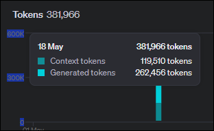
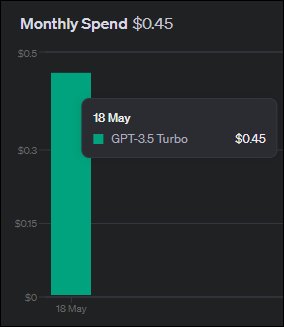

# Agent Swarm for Standards Research

This project uses OpenAI's API to research a list of standards for you, and output the results into (hopefully) a predictable JSON output.

- [Agent Swarm for Standards Research](#agent-swarm-for-standards-research)
  - [What does it do?](#what-does-it-do)
  - [Does it work?](#does-it-work)
  - [Getting Started](#getting-started)
    - [OpenAI API Token](#openai-api-token)
    - [OpenAI Billing \& Cost](#openai-billing--cost)
  - [Python Setup](#python-setup)
    - [Set up a virtual environment](#set-up-a-virtual-environment)
      - [Windows](#windows)
      - [macOS or Linux](#macos-or-linux)
    - [Pip Installs](#pip-installs)
  - [Modify and Run](#modify-and-run)


## What does it do?

You supply it a list of regulatory requirements like this:

<details>
<summary>Click to expand</summary>

```python
standards_list = [
    "PCI-DSS",
    "GDPR",
    "CCPA",
    "CPRA",
    "FDA 21 CFR Part 11",
    "FISMA",
    "FedRAMP",
    "GLBA",
    "HiTRUST",
    "HIPAA",
    "NAIC Model Law",
    "NIST CSF",
    "NYS DFS Regulation",
    "SOX"
]
```

</details>

and then a list of industry best practices like this:

<details>
<summary>Click to expand</summary>

```python
standards_list = [
    "OWASP API Security Top 10",
    "OWASP Top 10",
    "MITRE ATT&CK Framework",
    "CIS Controls",
    "CSA Security Guidance",        
    "ISO 22301 Security and Resilience / Business Continuity",
    "ISO/IEC 27001 Information Security, Cybersecurity and Privacy Protection",
    "ISO/IEC 27017 Security Techniques for Cloud Services",
    "ISO/IEC 27018 Security Techniques for PII in Public Cloud",
    "ISO/IEC 27032 Guidelines for Internet Security",
    "ISO/IEC 27035 Information Security Incident Management",
    "ISO/IEC 27701 Security Techniques for Privacy Information Management",
    "ISO/IEC 29100 Information Technology Privacy Framework",
    "NIST CSF (Cyber Security Framework)",
    "NIST Digital Identity Guidelines (SP 800-63*)",
    "NIST SP 800-34 (Contingency Planning Guide for Federal Information Systems)",
    "NIST SP 800-40 (Enterprise Patch Management)",
    "NIST SP 800-41 (Guidelines of Firewalls and Firewall Policy)",
    "NIST SP 800-53 (Security and Privacy Controls)",
    "NIST SP 800-61 (Computer Security Incident Handling Guide)",
    "NIST SP 800-92 (Guide to Computer Security Log Management)",
    "NIST SP 800-94 (Guide to Intrusion Detection and Preventions Systems (IDPS))",
    "NIST SP 800-128: Guide for Security-Focused Configuration Management of Information Systems",
    "NIST SP 800-137 (ISCM for Federal Information Systems and Organizations)",
    "NIST SP 800-150 (Guide to Cyber Threat Intelligence Sharing)",
    "RFC 5424 (The Syslog Protocol)",
    "RFC 6811 (BGP Prefix Origin Validation)",
    "RFC 6749 (OAuth 2.0 Authorization Framework)",
    "RFC 8725 (JWT Best Current Practices)",
    "RFC 7525 (Recommendations for TLS and DTLS)",
    "RFC 9110 (HTTP Semantics)",
    "SANS CWE Top 25 Software Errors",
    "SANS Secure Software Development and Code Analysis Tools - Whitepaper",
    "CSA CCM (Cloud Security Alliance - Cloud Controls Matrix)",
    "OWASP Source Analysis Tools",
    "OWASP Cheat Sheet Series"
]
```

</details>

This ultimately produces something: [example-regulatory.json](example-regulatory.json) and [example-best-practices.json](example-best-practices.json).

## Does it work?

Mostly. There are a couple of notable issues. First, despite being given specific instructions, sometimes the JSON output (although valid) is not in the format you requested. Meaning, if you have another downstream script that does something with this data, you need to account for that. Worse, since these standards are processed in isolation, the format could be different just for one standard.

Second is the inherent unknown of working with an LLM and "token" usage. See the output below, looking for the Error lines:

```syslog
[*] Processing Regulatory Requirements
[*] Initializing task and result queues for Regulatory Requirements
    - OWASP API Security Top 10
    - MITRE ATT&CK Framework
    - ISO/IEC 27001:2013
    - NIST Special Publication 800-53
    - CIS Controls
    - CSA Security Guidance
    - PCI-DSS
    - GDPR
    - CCPA
    - CPRA
    - FDA 21 CFR Part 11
    - FISMA
    - FedRAMP
    - GLBA
    - HiTRUST
    - HIPAA
    - NAIC Model Law
    - NIST CSF
    - NYS DFS Regulation
    - SOX
[*] Creating and starting 6 agents to process 20 standards...
[*] Waiting for all tasks to be processed
[Agent-3] Processed task for NIST Special Publication 800-53
[Agent-5] Processed task for CSA Security Guidance
[Agent-2] Processed task for ISO/IEC 27001:2013
[Agent-4] Processed task for CIS Controls
[Agent-1] Processed task for MITRE ATT&CK Framework
[Agent-3] Processed task for PCI-DSS
[Agent-2] Processed task for CCPA
[Agent-5] Processed task for GDPR
[Agent-4] Processed task for CPRA
[Agent-3] Processed task for FISMA
[Agent-1] Processed task for FDA 21 CFR Part 11
[Agent-0] Processed task for OWASP API Security Top 10
[Agent-4] Processed task for HiTRUST
[Agent-2] Processed task for FedRAMP
[Agent-4] Processed task for NYS DFS Regulation
[Agent-3] Processed task for HIPAA
[Agent-5] Processed task for GLBA
[Agent-1] Processed task for NAIC Model Law
[Agent-2] Processed task for SOX
[Agent-0] Processed task for NIST CSF
[+] Results written to regulatory.json
[+] Done.
[*] Processing Best Practices
[*] Initializing task and result queues for Best Practices
    - OWASP API Security Top 10
    - OWASP Top 10
    - MITRE ATT&CK Framework
    - ISO 22301 Security and Resilience / Business Continuity
    - ISO/IEC 27001 Information Security, Cybersecurity and Privacy Protection
    - ISO/IEC 27017 Security Techniques for Cloud Services
    - ISO/IEC 27018 Security Techniques for PII in Public Cloud
    - ISO/IEC 27032 Guidelines for Internet Security
    - ISO/IEC 27035 Information Security Incident Management
    - ISO/IEC 27701 Security Techniques for Privacy Information Management
    - ISO/IEC 29100 Information Technology Privacy Framework
    - NIST CSF (Cyber Security Framework)
    - NIST Digital Identity Guidelines (SP 800-63*)
    - NIST SP 800-34 (Contingency Planning Guide for Federal Information Systems)
    - NIST SP 800-40 (Enterprise Patch Management)
    - NIST SP 800-41 (Guidelines of Firewalls and Firewall Policy)
    - NIST SP 800-53 (Security and Privacy Controls)
    - NIST SP 800-61 (Computer Security Incident Handling Guide)
    - NIST SP 800-92 (Guide to Computer Security Log Management)
    - NIST SP 800-94 (Guide to Intrusion Detection and Preventions Systems (IDPS))
    - NIST SP 800-128: Guide for Security-Focused Configuration Management of Information Systems
    - NIST SP 800-137 (ISCM for Federal Information Systems and Organizations)
    - NIST SP 800-150 (Guide to Cyber Threat Intelligence Sharing)
    - RFC 5424 (The Syslog Protocol)
    - RFC 6811 (BGP Prefix Origin Validation)
    - RFC 6749 (OAuth 2.0 Authorization Framework)
    - RFC 8725 (JWT Best Current Practices)
    - RFC 7525 (Recommendations for TLS and DTLS)
    - RFC 9110 (HTTP Semantics)
    - SANS CWE Top 25 Software Errors
    - SANS Secure Software Development and Code Analysis Tools - Whitepaper
    - CSA CCM (Cloud Security Alliance - Cloud Controls Matrix)
    - OWASP Source Analysis Tools
    - OWASP Cheat Sheet Series
[*] Creating and starting 6 agents to process 34 standards...
[*] Waiting for all tasks to be processed
[Agent-5] Processed task for ISO/IEC 27017 Security Techniques for Cloud Services
[Agent-3] Processed task for ISO 22301 Security and Resilience / Business Continuity
[Agent-4] Processed task for ISO/IEC 27001 Information Security, Cybersecurity and Privacy Protection
[Agent-2] Processed task for MITRE ATT&CK Framework
[Agent-5] Processed task for ISO/IEC 27018 Security Techniques for PII in Public Cloud
[Agent-4] Processed task for ISO/IEC 27035 Information Security Incident Management
[Agent-1] Processed task for OWASP Top 10
[Agent-0] Processed task for OWASP API Security Top 10
[Agent-5] Processed task for ISO/IEC 29100 Information Technology Privacy Framework
[Agent-3] Processed task for ISO/IEC 27032 Guidelines for Internet Security
[Agent-1] Error processing task for NIST Digital Identity Guidelines (SP 800-63*): Expecting property name enclosed in double quotes: line 2 column 5 (char 6)
[Agent-2] Processed task for ISO/IEC 27701 Security Techniques for Privacy Information Management
[Agent-4] Processed task for NIST CSF (Cyber Security Framework)
[Agent-5] Processed task for NIST SP 800-40 (Enterprise Patch Management)
[Agent-0] Processed task for NIST SP 800-34 (Contingency Planning Guide for Federal Information Systems)
[Agent-3] Processed task for NIST SP 800-41 (Guidelines of Firewalls and Firewall Policy)
[Agent-4] Processed task for NIST SP 800-92 (Guide to Computer Security Log Management)
[Agent-1] Processed task for NIST SP 800-53 (Security and Privacy Controls)
[Agent-0] Processed task for NIST SP 800-128: Guide for Security-Focused Configuration Management of Information Systems
[Agent-5] Processed task for NIST SP 800-94 (Guide to Intrusion Detection and Preventions Systems (IDPS))
[Agent-3] Processed task for NIST SP 800-137 (ISCM for Federal Information Systems and Organizations)
[Agent-4] Processed task for NIST SP 800-150 (Guide to Cyber Threat Intelligence Sharing)
[Agent-1] Processed task for RFC 5424 (The Syslog Protocol)
[Agent-0] Processed task for RFC 6811 (BGP Prefix Origin Validation)
[Agent-5] Processed task for RFC 6749 (OAuth 2.0 Authorization Framework)
[Agent-4] Processed task for RFC 7525 (Recommendations for TLS and DTLS)
[Agent-3] Processed task for RFC 8725 (JWT Best Current Practices)
[Agent-2] Processed task for NIST SP 800-61 (Computer Security Incident Handling Guide)
[Agent-2] Processed task for OWASP Cheat Sheet Series
[Agent-1] Processed task for RFC 9110 (HTTP Semantics)
[Agent-4] Error processing task for CSA CCM (Cloud Security Alliance - Cloud Controls Matrix): Expecting ',' delimiter: line 14 column 9 (char 968)
[Agent-5] Processed task for SANS Secure Software Development and Code Analysis Tools - Whitepaper
[Agent-3] Processed task for OWASP Source Analysis Tools
[Agent-0] Processed task for SANS CWE Top 25 Software Errors
[+] Results written to best-practices.json
[+] Done.
```

As you can see from lines like:

```syslog
[Agent-1] Error processing task for NIST Digital Identity Guidelines (SP 800-63*): Expecting property name enclosed in double quotes: line 2 column 5 (char 6)
```

and also:

```syslog
[Agent-4] Error processing task for CSA CCM (Cloud Security Alliance - Cloud Controls Matrix): Expecting ',' delimiter: line 14 column 9 (char 968)
```

You get outputs like this when the output was too long. In the ChatGPT interface, there is a "Continue Generating" button. This code should ideally be modified to account for this too. As of now though, that particular item will fail.

## Getting Started

If this seems like something you want to try, below is what is required to run this on your machine.

### OpenAI API Token

This uses OpenAI's API for the Generative AI work. API access is separate from ChatGPT. So, even if you pay for the **ChatGPT Plus** plan, that does not include API access.

To get your API key, navigate to:

> **[https://platform.openai.com/api-keys](https://platform.openai.com/api-keys)**

If you plan to work with this API key, I would recommend creating a service account when prompted. With that key it gives you, create a file in this `src` folder called `.env` and put your key in, like this:

```env
OPENAI_API_KEY=sk-{service-account-name}-123456789012345678901234567890123456789012345678
```

> **NOTE:** This `.env` file should stay on your workstation and never be checked in with source control. There is a [../.gitignore](../.gitignore) entry for this already.

### OpenAI Billing & Cost

Again, the "cost" of this is separate from anything else. So, if you attempt to run the code with your freshly-minted API key, you will likely see a `429 TOO MANY REQUESTS` error with a notice about being over your quota.

You will need to purchase some token usage, first. You can do that from this page:

> [https://platform.openai.com/settings/organization/billing/overview](https://platform.openai.com/settings/organization/billing/overview)

I just put a credit card in as a Billing Method and purchased **$10**. How much will this cost you? Well, as I was developing this, I ran many tests. So far, I've used **$0.45** of the $10. That's using ~382K tokens:





## Python Setup

I'm using Python v3.10, but any version above v3.6 should be fine. v3.6 is when they introduced "F-strings", which is used throughout.

### Set up a virtual environment

From this `src` folder, run:

```bash
python3 -m venv .venv
```

Which will create a new virtual environment in this `src` folder. Then, "activate" this virtual environment:

#### Windows

```powershell
./.venv/scripts/activate.ps1
```

#### macOS or Linux

```bash
source ./.venv/bin/activate
```

### Pip Installs

To install the necessary prerequisites, run:

```bash
pip install -r ./requirements.txt
```

## Modify and Run

Next, look in the `main` function of [main.py](main.py) to modify your list of regulatory requirements and best practices sources. To run the script:

```bash
python3 ./main.py
```